# 📊 PowerView — Billing & Tiers System
# ระบบคิดค่าบริการและแพ็คเกจ

> **เอกสารนำเสนอระบบย่อย Billing & Tiers** สำหรับแพลตฟอร์ม PowerView IoT
> เวอร์ชัน: 1.0 | วันที่: 14 กรกฎาคม 2569

---

## 📋 สารบัญ (Table of Contents)

| # | หัวข้อ | รายละเอียด |
|:--|:-------|:-----------|
| 1 | [ภาพรวมระบบ](#1-ภาพรวมระบบ-system-overview) | สถาปัตยกรรมปัจจุบัน ความสัมพันธ์ Device ↔ User |
| 2 | [การคำนวณขนาดข้อมูล 1 Data Point](#2-การคำนวณขนาดข้อมูล-1-data-point) | ขนาด bytes ต่อ point, ต่อ device, ต่อเดือน |
| 3 | [รูปแบบการคิดราคาในอุตสาหกรรม](#3-รูปแบบการคิดราคาในอุตสาหกรรม-pricing-models) | เปรียบเทียบวิธีคิดเงินแบบสากล |
| 4 | [วิธีคิดเงินที่เลือกใช้สำหรับ PowerView](#4-วิธีคิดเงินที่เลือกใช้สำหรับ-powerview) | เหตุผลเชิงลึก การออกแบบ Tier, Free Tier |
| 5 | [ต้นทุน VPS Hosting สำหรับ InfluxDB](#5-ต้นทุน-vps-hosting-สำหรับ-influxdb) | เปรียบเทียบผู้ให้บริการ + แพ็คเกจที่แนะนำ |
| 6 | [การวิเคราะห์ต้นทุนข้อมูลแยกตาม Tier](#6-การวิเคราะห์ต้นทุนข้อมูลแยกตาม-tier-และจำนวนอุปกรณ์-scale-analysis) | วิเคราะห์พื้นที่และต้นทุนครบทั้ง 3 ระดับ (Free, Pro, Enterprise) |
| 7 | [การออกแบบฐานข้อมูลเพิ่มเติม](#7-การออกแบบฐานข้อมูลเพิ่มเติมสำหรับ-billing) | PostgreSQL Schema ใหม่ + เหตุผลของแต่ละฟิลด์ |
| 8 | [กลยุทธ์ Backup & Disaster Recovery](#8-กลยุทธ์-backup--disaster-recovery) | วิธีสำรอง + กู้คืนเมื่อเซิร์ฟเวอร์ล่ม |
| 9 | [เหตุผลการเลือกใช้เครื่องมือ](#9-เหตุผลการเลือกใช้เครื่องมือ-technology-justification) | ทำไมต้อง InfluxDB + PostgreSQL + Self-hosted |
| 10 | [โฟลว์การชำระเงินผ่าน Stripe](#10-โฟลว์การชำระเงินผ่าน-stripe-payment-gateway-flow) | ขั้นตอนและสถาปัตยกรรมการตัดเงิน/ต่ออายุ |

---

## 🌟 บทสรุปผู้บริหาร (Executive Summary)

เพื่อให้เข้าใจภาพรวมของสถาปัตยกรรมและกลยุทธ์ทั้งหมดอย่างรวดเร็ว นี่คือสรุป **เหตุผล (ทำไมถึงทำแบบนี้), ข้อดี (มันดียังไง), และกลไก (ทำงานยังไง)** ของระบบ Billing & Tiers สำหรับ PowerView IoT:

### 1. การคิดเงินผูกกับ "อุปกรณ์ (Device)" ไม่ใช่ "ผู้ใช้งาน (User)"
* **ทำไมถึงทำแบบนี้:** เพราะในโลกของ IoT อุปกรณ์ 1 เครื่อง สามารถมีคนดูได้หลายคน ต้นทุนเซิร์ฟเวอร์และค่าพื้นที่จัดเก็บ (Storage) จริงๆ แล้วเกิดขึ้นจาก "ปริมาณข้อมูลที่อุปกรณ์ส่งมา" (33 fields ทุกๆ 1 วินาที) ไม่ได้เกิดจากจำนวนคนที่เปิดดู
* **มันดียังไง:** สะท้อนต้นทุนที่แท้จริงของบริษัท ทำให้คำนวณต้นทุน/กำไรต่อเครื่องได้แม่นยำ ไม่มีอาการขาดทุนจากการแชร์บัญชีให้หลายคนดู และลูกค้าก็ไม่ต้องเจอเรื่องน่าปวดหัว (Bill Shock) เพราะราคาตายตัวคาดเดาได้
* **ทำงานยังไง:** ระบบเก็บเงินจะผูกกับตัวเครื่อง (Device ID) ใครจะเป็นคนจ่ายบิลก็ได้ พอจ่ายแล้ว เครื่องนั้นก็จะอัปเกรดเป็นระดับ Pro/Enterprise และทุกคนที่ได้รับสิทธิ์ให้ดูเครื่องนี้ก็จะดูข้อมูลแบบพรีเมียมได้ทันที

### 2. แพ็คเกจแบบ Hybrid (คิดต่อเครื่อง + แบ่งระดับ Tier ตามระยะเวลาดูย้อนหลัง)
* **ทำไมถึงทำแบบนี้:** หากคิดเงินตามปริมาณข้อมูลล้วนๆ ค่าใช้จ่ายลูกค้าจะแพงระดับแสนบาท หากให้จ่ายราคาเดียวแบบเหมาๆ พอสเกลใหญ่ขึ้นบริษัทจะขาดทุนค่าพื้นที่
* **มันดียังไง:** จัดสมดุลได้ลงตัว ลูกค้ายอมรับง่ายเพราะมี Free Tier และยอมจ่ายง่ายในระดับ Pro/Enterprise ส่วนบริษัทก็ได้ **กำไรขั้นต้น (Profit Margin) สูงถึง 95-97%** เพราะควบคุมเพดานของ Storage ต่อเครื่องได้
* **ทำงานยังไง:** ระบบอนุญาตให้ทุกคนดู Real-time ได้ฟรี! แต่คิดเงินเพิ่มเฉพาะการเก็บข้อมูลแบบละเอียด (1 วินาที) ย้อนหลัง 
   - **Free:** ดูย้อนหลัง 7 วัน
   - **Pro:** ย้อนหลัง 90 วัน
   - **Enterprise:** ย้อนหลัง 1 ปี

### 3. ระบบบีบอัดข้อมูลเก่า (Downsampling) และจัดการ Storage
* **ทำไมถึงทำแบบนี้:** ข้อมูลละเอียด 1 วินาที กินพื้นที่มหาศาล ยิ่งเก็บนานยิ่งเปลือง นอกจากนี้ข้อจำกัดของ InfluxDB คือตั้งเวลาลบข้อมูลอัตโนมัติ (Retention Policy) แยกระดับ Device ไม่ได้
* **มันดียังไง:** ลูกค้ายังสามารถดูกราฟค่าไฟย้อนหลังเป็นปีๆ ได้โดยที่ระบบเราไม่ต้องแบกรับภาระ Storage มหาศาล และไม่ต้องเขียนสคริปต์มาไล่ลบข้อมูลเก่าเองให้เปลืองทรัพยากร
* **ทำงานยังไง:** 
   - **Downsampling:** ใช้ Flux Tasks เฉลี่ยค่าข้อมูลจาก 1 วินาที → 1 นาที/1 ชม. ลดขนาดพื้นที่ลงได้ 60-3,600 เท่า
   - **Routing:** แยกฐานข้อมูลย่อย (Bucket) ตามแพ็คเกจเลย (Free=7วัน, Pro=90วัน) ระบบหน้าด่าน (Gateway) จะเช็คแพ็คเกจแล้วส่งข้อมูลลง Bucket ให้ถูกต้อง เมื่อถึงเวลา InfluxDB จะลบข้อมูลหมดอายุของแต่ละ Bucket ทิ้งไปเอง

### 4. สถาปัตยกรรมแบบ Self-hosted ด้วย VPS + InfluxDB + PostgreSQL
* **ทำไมถึงทำแบบนี้:** แพลตฟอร์ม Cloud สำเร็จรูปมีราคาแพงมากๆ หากมีการรับข้อมูลระดับเสี้ยววินาทีแบบเรา ยิ่งเครื่องเยอะยิ่งแพงกว่าเช่าเซิร์ฟเวอร์เอง 100 - 1,000 เท่า
* **มันดียังไง:** ประหยัดต้นทุนแบบสุดขีด (VPS เริ่มต้นแค่หลักร้อยบาท/เดือน) แต่ทรงพลัง รองรับเครื่องจำนวนมากได้ และบริษัทควบคุมข้อมูลของลูกค้าไว้ได้เอง (Data Sovereignty) 
* **ทำงานยังไง:** รันผ่าน Docker บน VPS โดย InfluxDB รับหน้าที่เก็บข้อมูล Time-Series มหาศาล PostgreSQL เก็บข้อมูลสำคัญเช่น User/Billing และใช้ MQTT ในการส่งข้อมูลจากฮาร์ดแวร์เพื่อประหยัดแบนด์วิธ

### 5. การใช้ Payment Gateway ผ่าน Stripe
* **ทำไมถึงทำแบบนี้:** ข้อมูลบัตรเครดิตลูกค้าเป็นของอันตราย การทำระบบจ่ายเงินเองต้องขอมาตรฐาน PCI-DSS ที่จุกจิกและใช้ต้นทุนมหาศาล
* **มันดียังไง:** บริษัทไม่ต้องสัมผัสข้อมูลบัตรเครดิตลูกค้าเลย โยนความเสี่ยงไปให้ Stripe รับจบ แถมยังสามารถเก็บเงินรายเดือนอัตโนมัติ (Subscription) ได้
* **ทำงานยังไง:** เมื่อลูกค้าจะจ่ายเงิน แอปจะส่งไปหน้าเว็บของ Stripe โดยตรง เมื่อจ่ายเสร็จ Stripe จะยิง Webhook กลับมาแจ้งเตือนที่เซิร์ฟเวอร์เบื้องหลังให้ทำการเปิดแพ็คเกจ ป้องกันปัญหาลูกค้ากดปิดแอปหรือเน็ตหลุดตอนชำระเงิน

---

## 1. ภาพรวมระบบ (System Overview)

### 1.1 สถาปัตยกรรมปัจจุบัน

PowerView เป็นแพลตฟอร์ม IoT ที่**ผลิตเครื่อง Power Meter ขายเอง** โดยมีแอปพลิเคชันมือถือให้ลูกค้าเชื่อมต่อเพื่อดูข้อมูลการใช้ไฟฟ้าแบบ Real-time

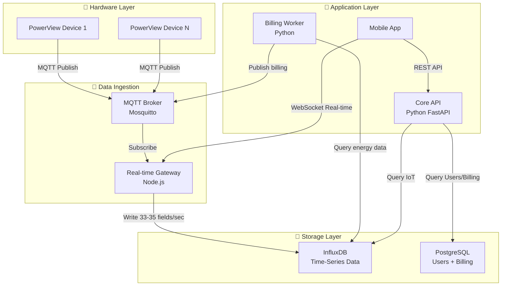
```mermaid
flowchart TD
    subgraph Hardware ["🔌 Hardware Layer"]
        HW1["PowerView Device 1"]
        HW2["PowerView Device N"]
    end

    subgraph Ingestion ["📡 Data Ingestion"]
        MQTT["MQTT Broker<br/>Mosquitto"]
        GW["Real-time Gateway<br/>Node.js"]
    end

    subgraph Storage ["💾 Storage Layer"]
        Influx["InfluxDB<br/>Time-Series Data"]
        PG["PostgreSQL<br/>Users + Billing"]
    end

    subgraph App ["📱 Application Layer"]
        API["Core API<br/>Python FastAPI"]
        Billing["Billing Worker<br/>Python"]
        Mobile["Mobile App"]
    end

    HW1 & HW2 -->|MQTT Publish| MQTT
    MQTT -->|Subscribe| GW
    GW -->|Write 33-35 fields/sec| Influx
    Billing -->|Query energy data| Influx
    Billing -->|Publish billing| MQTT
    API -->|Query IoT| Influx
    API -->|Query Users/Billing| PG
    Mobile -->|REST API| API
    Mobile -->|WebSocket Real-time| GW
```

### 1.2 ความสัมพันธ์ Device ↔ User (Many-to-Many)

**สิ่งที่เป็นอยู่ในปัจจุบัน:** การคิดเงินผูกกับ **Device** ไม่ใช่ User เนื่องจาก:

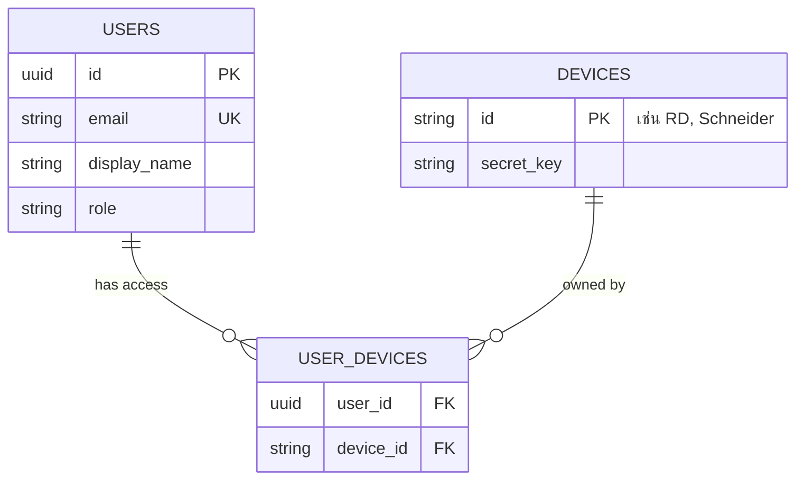
```mermaid
erDiagram
    USERS ||--o{ USER_DEVICES : "has access"
    DEVICES ||--o{ USER_DEVICES : "owned by"
    
    USERS {
        uuid id PK
        string email UK
        string display_name
        string role
    }
    DEVICES {
        string id PK "เช่น RD, Schneider"
        string secret_key
    }
    USER_DEVICES {
        uuid user_id FK
        string device_id FK
    }
```

- 1 Device อาจมีเจ้าของหลายคน (เช่น สมาชิกในครอบครัว หรือ ผู้เช่ากับเจ้าของ)
- 1 User อาจเป็นเจ้าของหลาย Device
- **ใครจะจ่ายเงินก็ได้** → Billing ผูกกับ Device ไม่ใช่ User

> **เหตุผล:** ในโลก IoT ตัว Device คือ "ต้นกำเนิดต้นทุน" (Cost Origin) เพราะ Device คือตัวที่สร้าง Data และกินทรัพยากรเซิร์ฟเวอร์ การคิดเงินต่อ Device จึงสะท้อนต้นทุนจริงได้ตรงกว่าการคิดต่อ User ที่อาจมีหลายคนดูข้อมูลเครื่องเดียวกัน

---

## 2. การคำนวณขนาดข้อมูล 1 Data Point

### 2.1 โครงสร้างข้อมูลที่เขียนลง InfluxDB

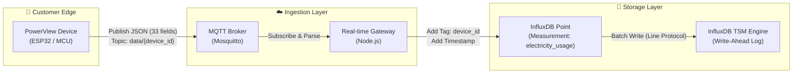
```mermaid
flowchart LR
    subgraph Edge ["🏢 Customer Edge"]
        HW["PowerView Device<br/>(ESP32 / MCU)"]
    end
    
    subgraph Ingestion ["☁️ Ingestion Layer"]
        MQTT["MQTT Broker<br/>(Mosquitto)"]
        GW["Real-time Gateway<br/>(Node.js)"]
    end
    
    subgraph Storage ["💾 Storage Layer"]
        Point["InfluxDB Point<br/>(Measurement: electricity_usage)"]
        Influx["InfluxDB TSM Engine<br/>(Write-Ahead Log)"]
    end

    HW -- "Publish JSON (33 fields)<br/>Topic: data/{device_id}" --> MQTT
    MQTT -- "Subscribe & Parse" --> GW
    GW -- "Add Tag: device_id<br/>Add Timestamp" --> Point
    Point -- "Batch Write (Line Protocol)" --> Influx
```
> **ข้อดี:** การแยก Gateway ออกจาก MQTT ทำให้รับโหลดได้มหาศาล และจัดรูปแบบข้อมูล (Parse) ให้เป็น Line Protocol ที่ InfluxDB ชอบก่อนเขียนลงไป
> **ข้อเสีย:** เพิ่ม Latency เล็กน้อย (ระดับมิลลิวินาที) และต้องดูแล Node.js Gateway เพิ่มอีก 1 Service

จากโค้ด Gateway (`realtime-gateway/index.js`) ระบบเขียนข้อมูลลง InfluxDB ด้วยรูปแบบนี้:

```javascript
// จากไฟล์ index.js บรรทัด 46-54
const point = new Point('electricity_usage')
    .tag('device_id', deviceId);  // Tag = 1 ตัว

// วนลูปเอาค่าตัวเลขทั้งหมดใส่เป็น Field
Object.keys(payload).forEach(key => {
    if (key !== 'device_id' && key !== 'timestamp' && typeof payload[key] === 'number') {
        point.floatField(key, payload[key]);  // float64 = 8 bytes ต่อ field
    }
});
```

### 2.2 ตัวอย่างข้อมูลจริง (33 Fields)

จากข้อมูลที่วัดได้จริง 1 device ส่ง 33 fields ทุกๆ 1 วินาที:

| กลุ่ม | Fields | รายละเอียด |
|:------|:-------|:-----------|
| Active Power | `active_power_l1`, `l2`, `l3`, `total` | 4 fields |
| Apparent Power | `apparent_power_l1`, `l2`, `l3`, `total` | 4 fields |
| Reactive Power | `reactive_power_l1`, `l2`, `l3`, `total` | 4 fields |
| Current | `current_l1`, `l2`, `l3` | 3 fields |
| Voltage | `voltage_l1`, `l2`, `l3` | 3 fields |
| Power Factor | `power_factor_l1`, `l2`, `l3`, `total` | 4 fields |
| THD Current | `thd_current_l1`, `l2`, `l3` | 3 fields |
| THD Voltage | `thd_voltage_l1`, `l2`, `l3` | 3 fields |
| Energy | `energy_import_total`, `energy_export_total`, `energy_import_export_total`, `energy_apparent_total` | 4 fields |
| Frequency | `frequency` | 1 field |
| **รวม** | | **33 fields** |

### 2.3 การคำนวณขนาดข้อมูล

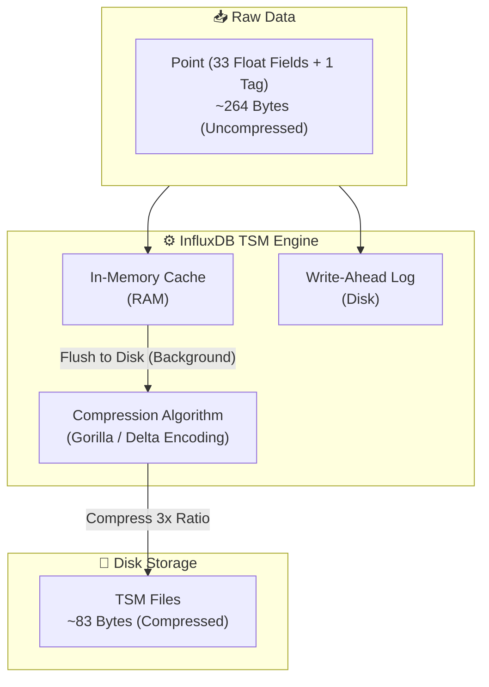
```mermaid
flowchart TD
    subgraph Input ["📥 Raw Data"]
        R1["Point (33 Float Fields + 1 Tag)<br/>~264 Bytes (Uncompressed)"]
    end
    
    subgraph Engine ["⚙️ InfluxDB TSM Engine"]
        Cache["In-Memory Cache<br/>(RAM)"]
        WAL["Write-Ahead Log<br/>(Disk)"]
        Comp["Compression Algorithm<br/>(Gorilla / Delta Encoding)"]
    end
    
    subgraph Output ["💾 Disk Storage"]
        TSM["TSM Files<br/>~83 Bytes (Compressed)"]
    end
    
    Input --> Cache & WAL
    Cache -- "Flush to Disk (Background)" --> Comp
    Comp -- "Compress 3x Ratio" --> TSM
```
> **ข้อดี:** TSM Engine ของ InfluxDB บีบอัดข้อมูล Time-series ที่เป็นตัวเลข (Float) ได้ดีมาก (Gorilla compression) ทำให้ประหยัดพื้นที่เซิร์ฟเวอร์มหาศาล (จาก 264 เหลือ 83 bytes)
> **ข้อเสีย:** การบีบอัดต้องใช้ CPU และ RAM ในเบื้องหลัง หาก Ingestion Rate สูงเกินไป (หลายแสนจุดต่อวินาที) CPU อาจจะตันได้

InfluxDB ใช้ TSM Engine ที่บีบอัดข้อมูลอย่างมีประสิทธิภาพ ตัวเลขที่ใช้คำนวณ:

> **ทำไมต้องคำนวณตรงนี้ก่อน?** เพราะตัวเลข "ขนาดข้อมูลต่อเครื่องต่อเดือน" คือตัวแปรที่สำคัญที่สุดในการออกแบบราคา Tier, ประมาณต้นทุนเซิร์ฟเวอร์, และตัดสินใจเลือก VPS ทั้งหมดในเอกสารนี้ล้วนอิงจากตัวเลขนี้ทั้งสิ้น หากตัวเลขนี้ผิด ทุกอย่างที่ตามมาจะผิดหมด จึงต้องใช้ทั้ง "ทฤษฎี" และ "การวัดจริง" มายืนยันกัน

#### ข้อมูลเชิงทฤษฎี (Theoretical)

| รายการ | ขนาด | หมายเหตุ |
|:-------|:------|:---------|
| **ค่า field (float64)** | 8 bytes (raw) → **~3 bytes (compressed)** | InfluxDB ใช้ Gorilla compression ลดได้ ~60% |
| **Timestamp** | 8 bytes (raw) → **~1 byte (compressed)** | Delta-of-delta encoding มีประสิทธิภาพสูง |
| **Tag (device_id)** | เก็บ 1 ครั้ง ใน index | ไม่ซ้ำทุก point |
| **Measurement name** | เก็บ 1 ครั้ง ใน index | ไม่ซ้ำทุก point |

**การคำนวณต่อ 1 Data Point (1 record, 1 field):**

```
1 Point = ~3 bytes (field value) + ~1 byte (timestamp overhead)
        ≈ 4 bytes (compressed, average)
```

#### ข้อมูลเชิงประจักษ์จากระบบจริง (Empirical)

จาก metrics ของ InfluxDB (`/metrics`) ระบบปัจจุบัน:

| Shard | ขนาด | ช่วงเวลาโดยประมาณ |
|:------|:------|:-------------------|
| id=1 | 90.5 MB | ~7 วัน (shard แรก) |
| id=2 | 571.4 MB | ~7 วัน |
| id=3 | 890.7 MB | ~7 วัน |
| id=4 | 167.4 MB | ~7 วัน (อยู่ระหว่างเขียน) |
| **รวม** | **~1.72 GB** | **~28 วัน (ข้อมูล 7-9 devices)** |

> **หมายเหตุ:** InfluxDB สร้าง Shard ใหม่ทุก 1-7 วัน โดยจะงอก id ใหม่ (เช่น id=5) เมื่อครบ shard duration

**การคำนวณจากข้อมูลจริง (8 devices, 33 fields, 1 วินาที):**

```
ข้อมูลต่อเดือน (จากการวัดจริง) ≈ 1.72 GB

จำนวน Points ต่อเดือน:
= 8 devices × 33 fields × 86,400 sec/day × 30 days
= 8 × 33 × 86,400 × 30
= 685,843,200 points/เดือน (~686 ล้าน points)

ขนาดต่อ Point (เฉลี่ยจากการวัดจริง):
= 1,720,000,000 bytes ÷ 685,843,200 points
≈ 2.51 bytes/point (compressed)
```

### 2.4 สรุปขนาดข้อมูลต่อ 1 Device

| หน่วยเวลา | จำนวน Points | ขนาด (compressed) | ขนาด (raw, ไม่บีบอัด) |
|:-----------|:-------------|:-------------------|:----------------------|
| **1 วินาที** | 33 points | ~83 bytes | ~264 bytes |
| **1 นาที** | 1,980 points | ~5 KB | ~15.5 KB |
| **1 ชั่วโมง** | 118,800 points | ~291 KB | ~928 KB |
| **1 วัน** | 2,851,200 points | ~6.83 MB | ~21.8 MB |
| **1 เดือน (30 วัน)** | 85,536,000 points | ~205 MB | ~654 MB |
| **1 ปี** | ~1,042 ล้าน points | ~2.5 GB | ~7.97 GB |

> **เหตุผลที่ใช้ ~2.5 bytes/point:** ค่านี้ได้จากการวัดจริงของระบบ PowerView ซึ่งสอดคล้องกับเอกสารอ้างอิงของ InfluxDB ที่ระบุว่า non-string field values ใช้พื้นที่ประมาณ 3 bytes/point หลังบีบอัด (ของเราต่ำกว่าเล็กน้อยเพราะค่าไฟฟ้ามีรูปแบบที่บีบอัดได้ดี)

---

## 3. รูปแบบการคิดราคาในอุตสาหกรรม (Pricing Models)

### 3.1 เปรียบเทียบ 5 รูปแบบหลัก


| # | รูปแบบ | วิธีการ | ตัวอย่างผู้ใช้ | ข้อดี | ข้อเสีย | เหมาะกับ |
|:--|:-------|:-------|:-------------|:------|:--------|:---------|
| 1 | **Per-Device (ต่อเครื่อง)** | คิดเงินตามจำนวนเครื่องที่ active ต่อเดือน/ปี | Blynk, ThingsBoard | คาดเดาได้ง่าย, ลูกค้าเข้าใจง่าย | ไม่ยืดหยุ่นหาก device สร้างข้อมูลต่างกันมาก | ✅ **Hardware OEM ที่ขายเครื่องเอง** |
| 2 | **Per-Data Point (ต่อ point)** | คิดเงินตามจำนวน data points ที่เขียนเข้า DB | InfluxDB Cloud, AWS IoT Core | สะท้อนต้นทุนจริง | "Bill Shock" — ลูกค้าคาดเดาค่าใช้จ่ายยาก | Big Data analytics platform |
| 3 | **Per-Retention (ตามระยะเก็บข้อมูล)** | คิดเงินตามจำนวนเดือน/ปีที่เก็บข้อมูลย้อนหลัง | SaaS monitoring tools | ตรงกับต้นทุน Storage | ซับซ้อน ลูกค้าต้องเข้าใจว่าข้อมูลย้อนหลังหมายความว่าอะไร | Logging/monitoring services |
| 4 | **Fixed Subscription (เหมาจ่าย)** | จ่ายคงที่ต่อเดือน/ปี ไม่จำกัดปริมาณ | SaaS ทั่วไป | เรียบง่ายสุด, ลูกค้าชอบ | ขาดทุนหาก device เยอะ, ไม่ยุติธรรมกับคนใช้น้อย | Consumer apps ขนาดเล็ก |
| 5 | **Hybrid (ผสม Base + Usage)** | มีค่าแพลตฟอร์มขั้นต่ำ + คิดตามปริมาณที่เกิน | AWS, Azure IoT Hub | ยืดหยุ่นสูง, สะท้อนต้นทุนจริง | ซับซ้อนที่สุด, ลูกค้าเข้าใจยาก | Enterprise IoT ขนาดใหญ่ |


> **ข้อดีของการเปรียบเทียบ:** ทำให้เห็นว่าไม่มีแบบไหนเพอร์เฟกต์ 100% การเลือก Hybrid แม้จะซับซ้อนในการตั้งค่า แต่ลดความเสี่ยงทางธุรกิจได้ดีที่สุด
> **ข้อเสีย:** สื่อสารกับลูกค้าได้ยากกว่าแบบ Flat Subscription ต้องทำตารางอธิบายให้ลูกค้าเข้าใจชัดเจน
---
### 3.2 ตัวอย่างราคาจากแพลตฟอร์มสากล (อ้างอิงปี 2025-2026)

| แพลตฟอร์ม | รูปแบบ | ราคาตัวอย่าง | Free Tier |
|:-----------|:-------|:-------------|:----------|
| **Blynk** | Per-Device/Tier | Starter: $29/เดือน (10 devices)<br/>Prototype: $99/เดือน (50 devices)<br/>Production: $199+/เดือน (100+ devices) | มี (จำกัด 5 devices) |
| **ThingsBoard Cloud** | Per-Entity/Tier (Modular) | Maker/Pilot: เริ่มต้น ~$15 - $20/เดือน<br/>(สามารถซื้อ Top-up เพิ่มจำนวนอุปกรณ์ได้) | มี (Community Edition หรือทดลองใช้) |
| **AWS IoT Core** | Per-Message | $1.00 ต่อ 1 ล้านข้อความ (ทีละ 5KB)<br/>+ ค่า Rule Engine และ Connection | มี (500,000 ข้อความฟรี 12 เดือนแรก) |
| **InfluxDB Cloud Serverless** | Per-Usage | Write: $0.0025 / MB<br/>Storage: $0.002 / GB-ชั่วโมง (~$1.44/GB/เดือน)<br/>Query: $0.012 / 100 queries | มี (จำกัด Data in และ retention 30 วัน) |

### 3.3 เปรียบเทียบเมื่อนำมาใช้กับ PowerView

สมมติมี 100 devices, ส่ง JSON (33 fields) ทุก 1 วินาที (259.2 ล้าน messages/เดือน, ขนาดรวม ~20.5 GB):

| รูปแบบ / ผู้ให้บริการ | ค่าใช้จ่ายโดยประมาณ/เดือน | ความเหมาะสม |
|:-------|:--------------------------|:------------|
| **Per-Device (Blynk Production)** | $199/เดือน (~6,900 ฿) | ⚠️ ง่าย แต่ต้นทุนสูงเมื่อเทียบกับ 100 เครื่อง |
| **Per-Message (AWS IoT Core)** | ~$259/เดือน (~9,000 ฿)* | ❌ แพง เพราะยิงข้อมูลถี่ (1 วินาที/เครื่อง) |
| **Per-Usage (InfluxDB Cloud)** | ~$81/เดือน (~2,800 ฿)** | ❌ ถูกกว่า แต่ยังแพงไปสำหรับ Free Tier |
| **Self-Hosted (VPS Hostinger)** | **~419 ฿/เดือน (KVM 2)** | ✅ **คุ้มค่าที่สุด รองรับได้มากกว่า 1,000 เครื่อง** |

> *\*คิดเฉพาะค่า Message ($1.00 x 259 ล้าน) ยังไม่รวมค่า Connection และ Rule Engine*
> *\*\*คิดเฉพาะค่า Data In ($51.25) และ Storage ($29.93) ยังไม่รวมค่า Query (Dashboard)*


---

## 4. วิธีคิดเงินที่เลือกใช้สำหรับ PowerView

### 4.1 ✅ รูปแบบที่เลือก: **Hybrid Per-Device + Retention Tiers**

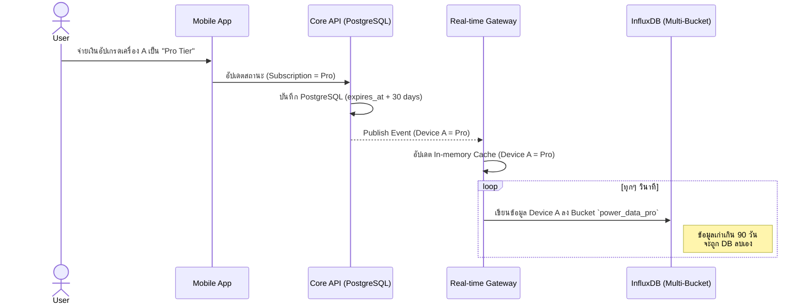
```mermaid
sequenceDiagram
    actor User
    participant App as Mobile App
    participant API as Core API (PostgreSQL)
    participant GW as Real-time Gateway
    participant DB as InfluxDB (Multi-Bucket)
    
    User->>App: จ่ายเงินอัปเกรดเครื่อง A เป็น "Pro Tier"
    App->>API: อัปเดตสถานะ (Subscription = Pro)
    API->>API: บันทึก PostgreSQL (expires_at + 30 days)
    API-->>GW: Publish Event (Device A = Pro)
    
    GW->>GW: อัปเดต In-memory Cache (Device A = Pro)
    
    loop ทุกๆ วินาที
        GW->>DB: เขียนข้อมูล Device A ลง Bucket `power_data_pro`
        Note right of DB: ข้อมูลเก่าเกิน 90 วัน<br/>จะถูก DB ลบเอง
    end
```
> **ข้อดี:** API แจ้ง Gateway ให้สลับถัง (Bucket) ได้แบบ Real-time ข้อมูลจะไหลเข้าถังใหม่ทันทีที่ลูกค้าจ่ายเงิน โดยที่เซิร์ฟเวอร์หลักแทบไม่ต้องประมวลผลเพิ่มเลย
> **ข้อเสีย:** ระบบต้องรักษา State ให้ซิงค์กันระหว่าง PostgreSQL กับ Gateway Cache ตลอดเวลา หาก Gateway Restart ต้องดึง State จาก PostgreSQL มาใหม่

เราเลือกใช้การผสมผสานระหว่าง **คิดตามจำนวน Device** กับ **คิดตามระยะเวลาดูข้อมูลย้อนหลังความละเอียด 1 วินาที**

```
ค่าบริการ = (จำนวน Device × ราคาต่อ Device/เดือน) 
            + ส่วนเพิ่มตาม Tier ที่ขอเก็บข้อมูลย้อนหลัง
```

### 4.2 เหตุผลที่เลือกรูปแบบนี้ (ไม่ใช่แบบอื่น)

| เหตุผล | รายละเอียด |
|:-------|:-----------|
| **ทำไมคิดตาม Device ไม่ใช่ตาม User?** | เพราะ User กับ Device เป็น Many-to-Many ตามฐานข้อมูล (`user_devices`) — 1 Device อาจมี 5 คนดู แต่สร้าง data เท่ากัน ต้นทุนเกิดจาก Device ไม่ใช่จำนวนคนดู |
| **ทำไมคิดตาม Device ไม่ใช่ตาม Point?** | เพราะเราผลิตเครื่องเอง ทุก device ส่ง 33 fields/วินาที เท่ากัน → ค่าใช้จ่ายต่อ device คาดเดาได้ 100% ไม่มี "Bill Shock" |
| **ทำไมต้องมี Retention Tier?** | เพราะต้นทุน Storage เพิ่มขึ้นตามจำนวนเดือนที่เก็บข้อมูล 1 วินาที ลูกค้าที่ต้องการดูข้อมูลย้อนหลัง 1 ปีแบบ 1 วินาที ใช้ disk มากกว่าคนที่ดูแค่ 7 วัน → ราคาต้องต่างกัน |
| **ทำไมไม่ Flat Rate (เหมาจ่าย)?** | เพราะ device 1 ตัว สร้างข้อมูล ~205 MB/เดือน (compressed) — 10,000 เครื่อง = 2 TB/เดือน → ต้นทุนไม่คงที่ ไม่สามารถเหมาจ่ายได้โดยไม่ขาดทุน |

### 4.3 โครงสร้างแพ็คเกจ (Tier Design)

#### 💡 หลักการออกแบบ Tier

การออกแบบ Tier ยึดหลัก **"Free ดูได้ ≠ Free เก็บได้"** — ข้อมูล Real-time แสดงฟรีทุก Tier แต่ข้อมูลย้อนหลังความละเอียดสูง (1 วินาที) ที่ต้อง Storage จริงเท่านั้นที่คิดเงิน

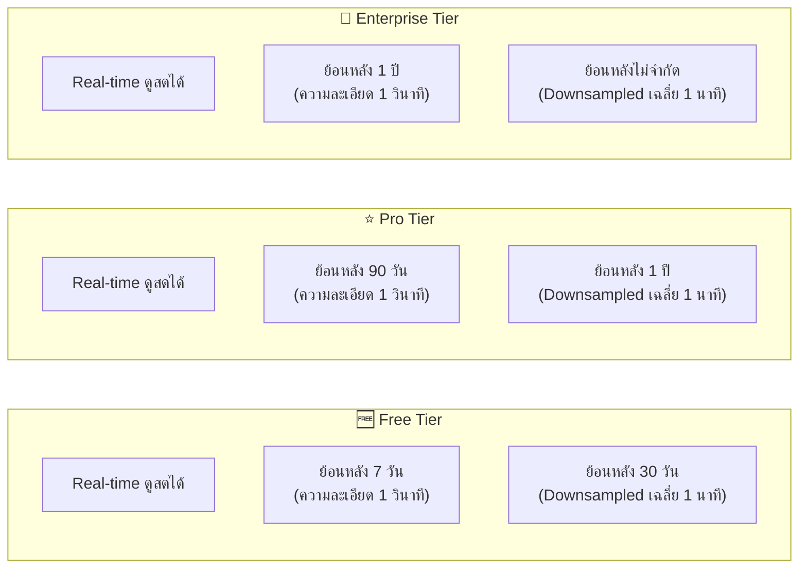
```mermaid
graph LR
    subgraph Free["🆓 Free Tier"]
        F1["Real-time ดูสดได้"]
        F2["ย้อนหลัง 7 วัน<br/>(ความละเอียด 1 วินาที)"]
        F3["ย้อนหลัง 30 วัน<br/>(Downsampled เฉลี่ย 1 นาที)"]
    end
    
    subgraph Pro["⭐ Pro Tier"]
        P1["Real-time ดูสดได้"]
        P2["ย้อนหลัง 90 วัน<br/>(ความละเอียด 1 วินาที)"]
        P3["ย้อนหลัง 1 ปี<br/>(Downsampled เฉลี่ย 1 นาที)"]
    end
    
    subgraph Ent["🏢 Enterprise Tier"]
        E1["Real-time ดูสดได้"]
        E2["ย้อนหลัง 1 ปี<br/>(ความละเอียด 1 วินาที)"]
        E3["ย้อนหลังไม่จำกัด<br/>(Downsampled เฉลี่ย 1 นาที)"]
    end
```

#### 📊 ตาราง Tier ละเอียด

| ฟีเจอร์ | 🆓 Free | ⭐ Pro | 🏢 Enterprise |
|:---------|:--------|:-------|:---------------|
| **ราคา / Device / เดือน** | ฟรี | 99 ฿ (~$2.80) | 299 ฿ (~$8.50) |
| **Real-time Data** | ✅ ไม่จำกัด | ✅ ไม่จำกัด | ✅ ไม่จำกัด |
| **ข้อมูล 1 วินาที ย้อนหลัง**<br/>*(Raw Data)* | 7 วัน<br/>`power_data_free` | 90 วัน (3 เดือน)<br/>`power_data_pro` | 365 วัน (1 ปี)<br/>`power_data_enterprise` |
| **ข้อมูลเฉลี่ย (1 นาที) ย้อนหลัง**<br/>*(Downsampled 1m)* | 30 วัน<br/>`power_data_1m_free` | 1 ปี<br/>`power_data_1m_pro` | ไม่จำกัด<br/>`power_data_1m_enterprise` |
| **ข้อมูลเฉลี่ย (1 ชั่วโมง) ย้อนหลัง**<br/>*(Downsampled 1h)* | **1 ปี**<br/>`power_data_1h_free` | **3 ปี**<br/>`power_data_1h_pro` | ไม่จำกัด<br/>`power_data_1h_enterprise` |
| **จำนวน Device สูงสุด** | 3 เครื่อง | ไม่จำกัด | ไม่จำกัด |
| **Export ข้อมูล CSV** | ❌ | ✅ | ✅ |
| **API Access** | ❌ | ✅ | ✅ |
| **รายงานค่าไฟ MEA ละเอียด** | Basic | Full (TOU/Tiered) | Full + Custom |
| **แจ้งเตือนผิดปกติ** | ❌ | ✅ | ✅ + Custom Rules |
| **จ่ายรายปี (ส่วนลด 20%)** | — | 948 ฿/ปี (~79 ฿/เดือน) | 2,868 ฿/ปี (~239 ฿/เดือน) |

### 4.4 เหตุผลของแต่ละ Tier

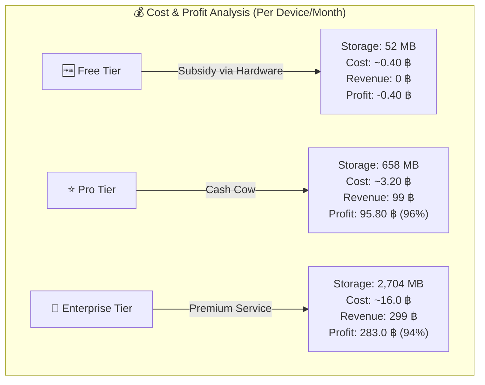
```mermaid
flowchart TD
    subgraph Cost_Analysis ["💰 Cost & Profit Analysis (Per Device/Month)"]
        direction LR
        
        T_Free["🆓 Free Tier"]
        T_Pro["⭐ Pro Tier"]
        T_Ent["🏢 Enterprise Tier"]
        
        C_Free["Storage: 52 MB<br/>Cost: ~0.40 ฿<br/>Revenue: 0 ฿<br/>Profit: -0.40 ฿"]
        C_Pro["Storage: 658 MB<br/>Cost: ~3.20 ฿<br/>Revenue: 99 ฿<br/>Profit: 95.80 ฿ (96%)"]
        C_Ent["Storage: 2,704 MB<br/>Cost: ~16.0 ฿<br/>Revenue: 299 ฿<br/>Profit: 283.0 ฿ (94%)"]
        
        T_Free -->|"Subsidy via Hardware"| C_Free
        T_Pro -->|"Cash Cow"| C_Pro
        T_Ent -->|"Premium Service"| C_Ent
    end
```
> **ข้อดี:** การทำ Cost Breakdown แบบนี้ ทำให้เห็นจุดคุ้มทุน (Break-even) ทันที Pro Tier คือตัวทำกำไรหลัก ส่วน Free Tier คือต้นทุนการตลาด (Customer Acquisition Cost)
> **ข้อเสีย:** ข้อมูลนี้ต้องปกปิดเป็นความลับภายใน (Internal Confidential) ห้ามให้ลูกค้าเห็นเด็ดขาด เพราะ Margin ที่สูงมากอาจทำให้ลูกค้าต่อรองราคาได้

#### 🆓 Free Tier — ทำไมต้องมี? ทำไมต้องแบบนี้?

| คำถาม | คำตอบ |
|:-------|:------|
| **ทำไมต้องมี Free?** | เพราะเราขายเครื่องฮาร์ดแวร์ → ลูกค้าซื้อเครื่องไปแล้ว ถ้าไม่มี Free จะรู้สึกว่า "ซื้อเครื่องแล้วยังต้องจ่ายอีก" → ทำให้ตัดสินใจซื้อยากขึ้น |
| **ทำไมจำกัด 3 เครื่อง?** | เพราะบ้านทั่วไปมีมิเตอร์ 1-2 ตัว จำกัด 3 ตัวก็เพียงพอสำหรับผู้ใช้ทั่วไป แต่ธุรกิจ/โรงงานที่มีหลายจุดวัดต้องจ่ายเงิน |
| **ทำไมดูย้อนหลังแค่ 7 วัน (1 วินาที)?** | เพราะ 7 วัน × 1 device = ~47.8 MB ไม่หนัก แต่ถ้าให้ 30 วัน = ~205 MB/device → 10,000 devices ฟรี = 2 TB ขาดทุนหนัก |
| **ทำไมถึงยอมให้ดูกราฟเฉลี่ยราย 1 ชั่วโมง ย้อนหลังได้ตั้ง 1 ปี?** | **เพื่อสนับสนุนการขายฮาร์ดแวร์ครับ!** ลูกค้าที่ซื้อสมาร์ทมิเตอร์คาดหวังว่าจะสามารถ "ดูประวัติค่าไฟรายเดือนเปรียบเทียบกันใน 1 ปีได้" ข้อมูลระดับ 1 ชั่วโมง (Downsample) ใช้พื้นที่น้อยมากๆ เพียง **~680 KB ต่อเครื่องต่อปี** เท่านั้น (10,000 เครื่องใช้พื้นที่แค่ไม่ถึง 7 GB) เป็นต้นทุนที่เซิร์ฟเวอร์แบกรับได้สบายๆ แลกกับการที่ลูกค้าประทับใจเครื่องและเซลส์ขายของง่ายขึ้น |

#### ⭐ Pro Tier — ทำไมราคานี้?

| คำถาม | คำตอบ |
|:-------|:------|
| **ทำไม 99 ฿/เครื่อง/เดือน?** | ต้นทุน Storage ต่อ device (90 วัน data, 1 วินาที) ≈ 18.45 GB → คิดเป็นต้นทุน VPS ~10-15 ฿/เครื่อง/เดือน, ราคา 99 ฿ ให้ margin ~85% สำหรับ operation + profit |
| **ทำไมเก็บ 90 วัน (ไม่ใช่ 30)?** | เพราะ 30 วันน้อยเกินไปสำหรับการวิเคราะห์แนวโน้มค่าไฟ ลูกค้าต้องเทียบเดือนก่อนกับเดือนนี้ → 90 วัน (3 เดือน) เป็นจุดที่ดีสำหรับการเปรียบเทียบรายไตรมาส |

#### 🏢 Enterprise Tier — ทำไมต้องมี?

| คำถาม | คำตอบ |
|:-------|:------|
| **ทำไมต้องมี Enterprise?** | โรงงาน/อาคาร ต้องเก็บข้อมูลย้อนหลัง 1 ปี+ เพื่อ compliance, ตรวจสอบคุณภาพไฟฟ้า, วิเคราะห์ THD ระยะยาว — ข้อมูลเหล่านี้ต้อง 1 วินาที resolution |
| **ทำไม 299 ฿?** | ต้นทุน Storage 1 ปี/device ≈ 2.5 GB compressed. เมื่อรวมกับค่า backup, redundancy, support → ราคา 299 ฿ ให้ margin ที่ยั่งยืน |

### 4.5 Downsampling Strategy

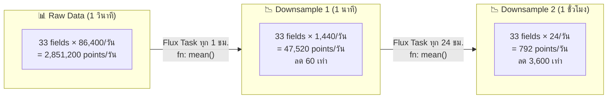
```mermaid
flowchart LR
    subgraph Raw["📊 Raw Data (1 วินาที)"]
        R["33 fields × 86,400/วัน<br/>= 2,851,200 points/วัน"]
    end
    
    subgraph DS1["📉 Downsample 1 (1 นาที)"]
        D1["33 fields × 1,440/วัน<br/>= 47,520 points/วัน<br/>ลด 60 เท่า"]
    end
    
    subgraph DS2["📉 Downsample 2 (1 ชั่วโมง)"]
        D2["33 fields × 24/วัน<br/>= 792 points/วัน<br/>ลด 3,600 เท่า"]
    end
    
    Raw -->|"Flux Task ทุก 1 ชม.<br/>fn: mean()"| DS1
    DS1 -->|"Flux Task ทุก 24 ชม.<br/>fn: mean()"| DS2
```

**วิธีการ Downsample ที่ใช้:** InfluxDB 2.x Flux Tasks

> **ทำไมใช้ Flux Tasks ไม่ใช้ Python Cron Script?**
> * Flux Tasks เป็นเครื่องมือในตัว (built-in) ของ InfluxDB รันอยู่ภายใน Database Engine เลย → ไม่ต้องดึงข้อมูลออกมาประมวลผลภายนอกแล้วยัดกลับ (ประหยัด Network I/O และ RAM)
> * Python Cron Script ต้องติดตั้ง library เพิ่ม ต้องดึงข้อมูลออกมาผ่าน API แล้วเขียนกลับ → ช้ากว่า กิน RAM กว่า และเพิ่มจุดที่ระบบอาจพังได้ (Single Point of Failure)
> * **ทางเลือกอื่นที่พิจารณาแล้ว:** InfluxDB 3.x (IOx engine) มีระบบ Continuous Queries ใหม่ แต่ยังอยู่ในช่วง Beta ไม่เหมาะนำมาใช้ในระบบ Production ในตอนนี้

```flux
> 💡 **การประยุกต์ใช้ Downsample ร่วมกับระบบ Tiers (Multi-Bucket):**
> เนื่องจากเราใช้ท่า Multi-Bucket ในการแยกเกรดลูกค้า (ดูรายละเอียดเต็มๆ ในหัวข้อ 10) ดังนั้นการทำ Downsample จึง **"ต้องแยก Bucket ตาม Tier ด้วยเช่นกัน"** ครับ 
> 
> ระบบจะต้องสร้าง Flux Tasks ขนานกัน 3 เส้นทาง เพื่อดึงข้อมูลจากถัง Raw ของแต่ละ Tier ไปใส่ถัง Downsample ของตัวเอง เพื่อให้สามารถตั้งค่าอายุการเก็บรักษา (Retention) ได้อิสระ:
> 
> 1. ดึงจาก `power_data_free` (ดิบ 7 วัน) → เทลง `power_data_1m_free` (ตั้ง Retention ลบอัตโนมัติ 30 วัน)
> 2. ดึงจาก `power_data_pro` (ดิบ 90 วัน) → เทลง `power_data_1m_pro` (ตั้ง Retention ลบอัตโนมัติ 1 ปี)
> 3. ดึงจาก `power_data_enterprise` (ดิบ 365 วัน) → เทลง `power_data_1m_enterprise` (ตั้ง Retention ไม่จำกัดอายุ)
> 
> **ข้อดี:** วิธีนี้ทำให้เราสามารถแยกระยะเวลาจัดเก็บตาม Tier ได้อย่างสมบูรณ์แบบ โดยที่เซิร์ฟเวอร์ไม่ต้องใช้ CPU มาไล่ลบข้อมูล Downsample ของคนใช้ฟรีเลย (InfluxDB จัดการทิ้งให้เองเมื่อครบ 30 วัน) รวมทั้งระบบทั้งหมดจะมีแค่ 9 Buckets เท่านั้น ซึ่ง InfluxDB สบายมาก (รับได้หลักร้อย Buckets โดยไม่กระทบ RAM)

```flux
// ตัวอย่าง Task สำหรับ Downsample สาย Free (1 วินาที → 1 นาที)
option task = {name: "downsample_1m_free", every: 1h}

from(bucket: "power_data_free") // ดึงจากถังดิบสายฟรี
  |> range(start: -task.every)
  |> filter(fn: (r) => r._measurement == "electricity_usage")
  |> aggregateWindow(every: 1m, fn: mean, createEmpty: false)
  |> to(bucket: "power_data_1m_free", org: "rdcomp") // ยัดลงถัง Downsample ของสายฟรี
```

**เหตุผลที่เลือก `mean()` (ค่าเฉลี่ย) ไม่ใช่ `last()` หรือ `max()`:**
- ข้อมูลเซ็นเซอร์ไฟฟ้า (Voltage, Current, Power) เป็นข้อมูลต่อเนื่อง (continuous) → `mean()` ให้ภาพรวมที่ถูกต้องที่สุด
- `last()` เหมาะกับ state data (เปิด/ปิด) ไม่เหมาะกับค่าไฟที่ต่อเนื่อง
- `max()` เหมาะกับการวิเคราะห์ peak แต่ไม่สะท้อนภาพรวมการใช้ไฟ

**ขนาดข้อมูลหลัง Downsample:**

| ประเภทข้อมูล | Resolution | ขนาดต่อ Device ต่อเดือน | ลดลงจาก Raw |
|:-------------|:-----------|:------------------------|:-------------|
| Raw Data | 1 วินาที | ~205 MB | — |
| Downsampled 1m | 1 นาที | ~3.4 MB | 60× |
| Downsampled 1h | 1 ชั่วโมง | ~57 KB | 3,600× |

---

### 4.6 กลยุทธ์การจัดการข้อมูลเก่า (Data Pruning & Multi-Bucket Strategy)

#### ปัญหาของ InfluxDB (Retention Policy Limitation)

ตามโครงสร้าง InfluxDB, **Retention Policy (กฎการลบข้อมูลอัตโนมัติ)** จะตั้งค่าได้ที่ระดับ **Bucket** เท่านั้น ไม่สามารถตั้งค่าแยกระดับ Device ได้ 

หากเราเก็บข้อมูลดิบ (1 วินาที) ของทุกอุปกรณ์ไว้ใน Bucket ชื่อ `power_data` เหมือนกันหมด:
- เครื่อง Free Tier: ควรเก็บแค่ 7 วัน
- เครื่อง Pro Tier: ควรเก็บ 90 วัน
- เครื่อง Enterprise Tier: ควรเก็บ 365 วัน (1 ปี)
- **ผลลัพธ์:** เราไม่สามารถใช้ฟีเจอร์ Retention อัตโนมัติของ InfluxDB เพื่อเคลียร์ข้อมูลได้ เพราะถ้าตั้ง 7 วัน ข้อมูลของ Pro/Enterprise ก็จะหายไปด้วย ถ้าตั้ง 365 วัน ข้อมูลของ Free ก็จะบวมกินพื้นที่มหาศาล

#### ทางออกที่เลือกใช้: Multi-Bucket Routing

เราจะแก้ปัญหานี้โดยการแยกพื้นที่เก็บข้อมูลดิบ (Raw Data) ออกเป็น 3 Buckets หลักตาม Tier:

1. `power_data_free`: ตั้ง Retention 7 วัน (ข้อมูลเก่าจะลบเองโดยอัตโนมัติ ไม่ต้องเขียนโค้ด)
2. `power_data_pro`: ตั้ง Retention 90 วัน 
3. `power_data_enterprise`: ตั้ง Retention 365 วัน 

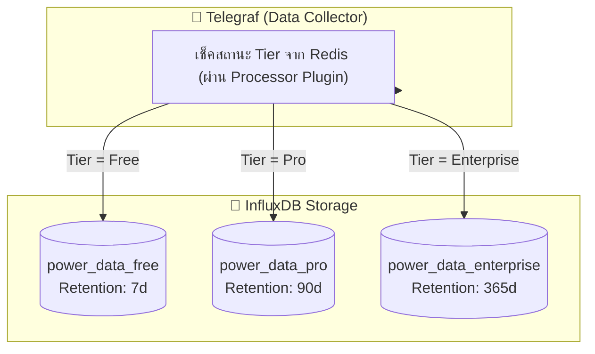
```mermaid
flowchart TD
    subgraph Gateway ["📡 Telegraf (Data Collector)"]
        Check["เช็คสถานะ Tier จาก Redis (ผ่าน Processor Plugin)"]
    end
    
    subgraph Influx ["💾 InfluxDB Storage"]
        BucketF[("power_data_free<br/>Retention: 7d")]
        BucketP[("power_data_pro<br/>Retention: 90d")]
        BucketE[("power_data_enterprise<br/>Retention: 365d")]
    end
    
    Gateway --> Check
    Check -- "Tier = Free" --> BucketF
    Check -- "Tier = Pro" --> BucketP
    Check -- "Tier = Enterprise" --> BucketE
```

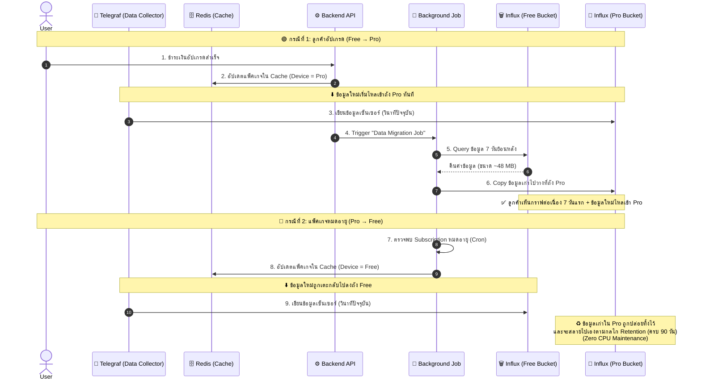
```mermaid
sequenceDiagram
    autonumber
    actor User
    participant GW as 📡 Telegraf (Data Collector)
    participant Redis as 🗄️ Redis (Cache)
    participant API as ⚙️ Backend API
    participant Worker as 🔄 Background Job
    participant DB_F as 🗑️ Influx (Free Bucket)
    participant DB_P as 💾 Influx (Pro Bucket)

    Note over User,DB_P: 🟢 กรณีที่ 1: ลูกค้าอัปเกรด (Free → Pro)
    User->>API: 1. ชำระเงินอัปเกรดสำเร็จ
    API->>Redis: 2. อัปเดตแพ็คเกจใน Cache (Device = Pro)
    Note over GW,DB_P: ⬇️ ข้อมูลใหม่เริ่มไหลเข้าถัง Pro ทันที
    GW->>DB_P: 3. เขียนข้อมูลเซ็นเซอร์ (วินาทีปัจจุบัน)
    API->>Worker: 4. Trigger "Data Migration Job"
    Worker->>DB_F: 5. Query ข้อมูล 7 วันย้อนหลัง
    DB_F-->>Worker: คืนค่าข้อมูล (ขนาด ~48 MB)
    Worker->>DB_P: 6. Copy ข้อมูลเก่าไปวางที่ถัง Pro
    Note over DB_F,DB_P: ✅ ลูกค้าเห็นกราฟต่อเนื่อง 7 วันแรก + ข้อมูลใหม่ไหลเข้า Pro

    Note over User,DB_P: 🔴 กรณีที่ 2: แพ็คเกจหมดอายุ (Pro → Free)
    Worker->>Worker: 7. ตรวจพบ Subscription หมดอายุ (Cron)
    Worker->>Redis: 8. อัปเดตแพ็คเกจใน Cache (Device = Free)
    Note over GW,DB_F: ⬇️ ข้อมูลใหม่ถูกเตะกลับไปลงถัง Free
    GW->>DB_F: 9. เขียนข้อมูลเซ็นเซอร์ (วินาทีปัจจุบัน)
    Note over DB_P: ♻️ ข้อมูลเก่าใน Pro ถูกปล่อยทิ้งไว้<br/>และจะสลายไปเองตามกลไก Retention (ครบ 90 วัน)<br/>(Zero CPU Maintenance)
```

**เมื่อมีการ Upgrade (เช่น Free → Pro / Enterprise) ต้องทำ Data Migration:**
1. **ข้อมูลใหม่:** ระบบจะเปลี่ยน Routing เขียนข้อมูลใหม่ลง Bucket ของ Tier ใหม่ (`power_data_pro` หรือ `power_data_enterprise`) ทันทีตั้งแต่วินาทีที่อัปเกรดเสร็จ
2. **ข้อมูลเก่า (อพยพข้อมูล):** ระบบหลังบ้านต้องทริกเกอร์ **Background Job** เพื่อ Query ข้อมูลของเครื่องนั้นจากถังเดิมมาเขียนลงถังใหม่ (Free → Pro หรือ Pro → Enterprise)
   * ***คำถาม: การอพยพข้อมูลกิน RAM/ทรัพยากรแค่ไหน?*** 
   * **คำตอบ:** 
     * **กรณี Free → Pro:** กินทรัพยากร "น้อยมาก" เพราะปริมาณข้อมูลดิบเพียง ~48 MB ต่ออุปกรณ์ ใช้เวลาเพียงเสี้ยววินาทีแทบไม่กระทบเซิร์ฟเวอร์
     * **กรณี Pro → Enterprise:** ข้อมูลสูงสุด 90 วัน จะมีขนาดใหญ่ขึ้นเป็น ~658 MB ต่ออุปกรณ์ แม้จะใช้เวลาประมวลผลนานขึ้น (5-15 วินาทีต่อเครื่อง) แต่ระบบจะจัดการโดยใช้ **Background Job (Queue) ทยอยทำทีละคิว** เพื่อไม่ให้กระทบประสิทธิภาพของเซิร์ฟเวอร์หลัก (API)
   * ⚠️ **ข้อควรระวัง (จุดตาย):** ไม่ว่าจะเป็นการอัปเกรดแบบใด "ห้าม" ปล่อยข้อมูลเก่าทิ้งไว้ในถังเดิมเด็ดขาด! (เช่น ปล่อยทิ้งใน Pro) เพราะถังเดิมมีระเบิดเวลา Retention อยู่ หากไม่ก๊อปปี้ออกมาใส่ถัง Enterprise ข้อมูลจะถูกทำลายทิ้งอัตโนมัติเมื่อครบ 90 วัน
3. **ผลลัพธ์:** ข้อมูลเก่าจะได้ย้ายมาอยู่ใต้กฎ 90/365 วันทันที ลูกค้าจะเห็นกราฟต่อเนื่องไร้รอยต่อ

**เมื่อ Subscription หมดอายุ (Expired) แล้วร่วงกลับเป็น Free:**
1. ระบบจะเปลี่ยนปลายทางเขียนข้อมูลใหม่กลับไปที่ `power_data_free` 
2. ข้อมูลเก่าที่เคยอยู่ใน `power_data_pro` จะถูกปล่อยทิ้งไว้เฉยๆ (ไม่ต้องไปสั่งลบ) เมื่อเวลาผ่านไป InfluxDB จะทยอยลบทิ้งเองอัตโนมัติตามกลไก Retention ทำให้เราประหยัด CPU มหาศาล

#### 💡 กฎเหล็กของ API: การใช้ `union()` เพื่อกราฟที่ไร้รอยต่อ (Gap Prevention)
ไม่ว่าจะเป็นการ **ดาวน์เกรด (Downgrade)** หรือ **อัปเกรด (Upgrade)** การแสดงผลกราฟในฝั่ง Backend API **ต้องใช้เทคนิค `union()` ดึงข้อมูลจากหลายถังมาต่อกันเสมอ** เพื่อป้องกันปัญหากราฟแหว่ง (Data Gap):
* **กรณี Downgrade:** ข้อมูลใหม่ลงถัง Free ข้อมูลเก่าค้างใน Pro → `union()` จะช่วยต่อจิ๊กซอว์ 2 ถังนี้ให้ลูกค้าเห็นกราฟ 7 วันแบบต่อเนื่อง โดยที่เราไม่ต้องเขียนสคริปต์ก๊อปปี้ข้อมูลกลับ
* **กรณี Upgrade:** แม้เราจะมี Background Job คอยก๊อปปี้ข้อมูลมาใส่ถังใหม่ให้ แต่ในระหว่างที่ Job กำลังรอคิวทำงาน (Queue) ข้อมูลวินาทีใหม่จะไปลงถังใหม่แล้ว ในขณะที่ข้อมูลเก่ายังตกค้างอยู่ถังเดิม → `union()` จะช่วยอุดช่องโหว่ตรงนี้ ทำให้กราฟของลูกค้าไม่แหว่งเลยแม้แต่วินาทีเดียว แม้ Background Job จะยังรันไม่เสร็จก็ตาม!

```flux
// 💡 ตัวอย่าง Flux Query ที่ Backend API ใช้ดึงข้อมูล (ดึงถังที่เกี่ยวข้องมาต่อกันเสมอ)
data_free = from(bucket: "power_data_free") |> range(start: -7d) |> filter(fn: (r) => r.device_id == "DEV-001")
data_pro  = from(bucket: "power_data_pro")  |> range(start: -7d) |> filter(fn: (r) => r.device_id == "DEV-001")

// สั่ง InfluxDB ให้รวมข้อมูลเข้าด้วยกัน (เนียนกริบ ไร้รอยต่อ แม้อยู่ในช่วงสลับแพ็คเกจ)
union(tables: [data_free, data_pro]) 
```

> ⚙️ **Best Practice เชิงโค้ดดิ้ง: เมื่อไหร่ที่ API ควรเลิกใช้ `union()`?**
> โดยทางทฤษฎี ระบบสามารถเลิกใช้ `union()` (กลับไป Query ถังเดียว) ได้เมื่อช่วงเวลาเปลี่ยนผ่าน (Transition) จบลง:
> 1. **กรณี Downgrade:** เลิกได้เมื่อผ่านไป **ครบ 7 วันหลังหมดอายุ** (เพราะข้อมูล 7 วันล่าสุดจะอยู่ในถัง Free ครบ 100% แล้ว)
> 2. **กรณี Upgrade:** เลิกได้ทันทีที่ **Background Job อพยพข้อมูลเสร็จสมบูรณ์** (ตรวจสอบจากสถานะใน PostgreSQL)
>
> 💡 **แต่ในทางปฏิบัติ (Real-world Coding):** Developer ส่วนใหญ่มักจะ **"เขียน `union()` ทิ้งไว้ตลอดไป"** สำหรับกลุ่มผู้ใช้ Free ครับ! เหตุผลคือ InfluxDB ค้นหาข้อมูลในถังที่ไม่มีข้อมูลตรงเงื่อนไข (เช่น ถัง Pro ที่ข้อมูลเก่าเกิน 7 วันไปแล้ว) ได้เร็วมากระดับเสี้ยว Millisecond การเขียน `union()` ทิ้งไว้เลย จะช่วยให้โค้ดฝั่ง Backend คลีนมาก ไม่ต้องมาเขียน `if-else` เช็ควันที่ให้วุ่นวายและเสี่ยงต่อการเกิด Bug ครับ

> 🛡️ **ความแนบเนียนของ API Paywall (เมื่อเวลาผ่านไปเกิน 7 วันหลังหมดอายุ):**
> มีคำถามว่า *"ถ้าดาวน์เกรดมาเป็น Free แล้ว ข้อมูลในถัง Pro เดิมมันมีอายุตั้ง 90 วัน มันจะไม่มาปนกับถัง Free หรือทำให้กราฟเพี้ยนหรอ?"*
> **คำตอบคือ ไม่เพี้ยนครับ และไม่ต้องสั่งลบด้วย!** เพราะกุญแจสำคัญอยู่ที่ "ขอบเขตเวลา (Time Range)" ของ API:
> * **ช่วง 1-6 วันแรกหลังหมดอายุ:** กราฟจะดึงข้อมูลผสมกัน (ถัง Free + ถัง Pro เก่า) ด้วย `union()` เพื่อให้ลูกค้าเห็นกราฟ 7 วันแบบไร้รอยต่อ
> * **วันที่ 7 เป็นต้นไป:** ถัง Free เก็บข้อมูลครบ 7 วันพอดี ส่วนข้อมูลในถัง Pro จะมีอายุ "เก่ากว่า 7 วัน" ทั้งหมด
> * ทันทีที่ข้อมูลเก่ากว่า 7 วัน คำสั่ง `range(start: -7d)` ของ API จะทำหน้าที่เป็น **Paywall (กำแพงสิทธิ์)** บดบังข้อมูลในถัง Pro ไปโดยอัตโนมัติ! แม้ข้อมูล 90 วันจะยังนอนรออยู่ในฐานข้อมูลอย่างสมบูรณ์แบบ แต่ลูกค้า Free ก็จะไม่มีทางมองเห็นได้เลย จนกว่าจะยอมจ่ายเงินอัปเกรดเพื่อปลดล็อก `range(start: -90d)` อีกครั้ง

> 💡 **กรณีศึกษา (ช่องโหว่): ถ้าลูกค้า Pro เลิกต่ออายุไป 40 วัน แล้วค่อยกลับมาต่อใหม่ เพื่อเนียนประหยัดค่าบริการ 1 เดือน จะเกิดอะไรขึ้น?**
>
> **สิ่งที่เกิดขึ้นคือ "ลูกค้าจะสูญเสียข้อมูลแหว่งหายไป 33 วันถาวรครับ"** กลไก Multi-Bucket ของเราจะทำการลงโทษ (Punish) ลูกค้าที่ไม่ต่ออายุโดยอัตโนมัติ (และสมเหตุสมผลตามเงื่อนไข Free Tier) ดังนี้:
> 
> * **ช่วง 40 วันที่ไม่จ่ายเงิน:** ข้อมูลใหม่จะถูกเตะไปเขียนที่ `power_data_free` (ซึ่งเก็บย้อนหลังได้แค่ 7 วัน) แปลว่าข้อมูลของวันที่ 1 ถึงวันที่ 33 **จะถูกระบบ InfluxDB ลบทำลายทิ้งไปแล้วเรียบร้อย กู้ไม่ได้**
> * **ข้อมูลเก่าใน Pro เดิมละ?:** ข้อมูลตอนที่เคยเป็น Pro จะยังอยู่ (ถ้ายังไม่เกิน 90 วัน) กราฟช่วงนั้นจะยังดูได้ปกติ
> * **ตอนกลับมาจ่ายเงิน (วันที่ 40):** ระบบจะทำการ Data Migration ก๊อปปี้ข้อมูลจาก Free มาใส่ Pro... **แต่! ข้อมูลใน Free มันเหลือแค่ 7 วันล่าสุดเท่านั้น (วันที่ 34-40)**
> * **บทสรุปของลูกค้าคนนี้:** เขายอมประหยัดเงิน 99 บาทแลกกับการที่ **กราฟข้อมูล IoT ของเขาแหว่งหายไป 33 วันแบบกู้คืนไม่ได้** ซึ่งสำหรับโรงงานหรือธุรกิจ ข้อมูลความต่อเนื่องสำคัญกว่าเงิน 99 บาทแน่นอนครับ ระบบนี้จึงเป็นการบีบให้ลูกค้าต้อง "ต่ออายุอย่างต่อเนื่อง (Auto-renew)" โดยที่เราไม่ต้องไปทำระบบล็อคกราฟให้วุ่นวายครับ

#### ⚙️ สถาปัตยกรรมของ Background Job (Worker Process)
Background Job **ไม่ใช่ฐานข้อมูล และไม่ใช่ API หลัก (Main API)** ที่คอยรับ Request จากผู้ใช้งานครับ แต่มันคือ **"โปรเซสที่แยกออกมาทำงานอยู่หลังบ้าน (Worker Process)"** 

**ทำไมถึงต้องแยก Background Job ออกมา?**
เมื่อลูกค้าอัปเกรดแพ็คเกจ (เช่น Pro → Enterprise) จะมีข้อมูลต้องย้ายมากสุดถึง ~658 MB ต่ออุปกรณ์ หากเราให้ Main API เป็นคนคอยดึงและย้ายข้อมูลนี้ เซิร์ฟเวอร์ API อาจจะเกิดอาการ "หน่วงหรือค้าง (Timeout)" ทำให้แอปฝั่งลูกค้าคนอื่นๆ ค้างไปด้วย การแยก Worker ออกมาจะทำให้ Main API ว่างเสมอและตอบสนองผู้ใช้ได้ลื่นไหลตลอดเวลา

**ลำดับการทำงาน (ใครทำอะไรในระบบ):**
1. **Main API:** รับ Webhook แจ้งชำระเงินสำเร็จจาก Stripe → อัปเดตตารางผู้ใช้ใน PostgreSQL ให้เป็นแพ็คเกจใหม่ → โยน "ใบสั่งงานย้ายข้อมูล" ลงไปในตะกร้าคิว (Message Queue) → ตอบกลับแอปมือถือทันทีว่าอัปเกรดสำเร็จ 
2. **Message Queue (Redis):** ทำหน้าที่เป็นตะกร้ารับคิวงาน (เนื่องจากโครงสร้างระบบมี Redis ใช้อยู่แล้ว จึงเอามาทำคิวได้เลย)
3. **Background Job (Worker):** โปรแกรมที่ถูกรันแยกไว้ มันจะคอยจ้องมอง Redis ตลอดเวลา พอเห็นมีคิวงานหล่นมา ก็จะหยิบไปส่งคำสั่งให้ InfluxDB ทำการก๊อปปี้ข้อมูล
4. **PostgreSQL:** เมื่อ InfluxDB ย้ายข้อมูลเสร็จ Worker จะแวะมาอัปเดตสถานะในตารางว่า `migration_status = 'completed'`

*(💡 คำแนะนำสำหรับ Developer: หากแบ็คเอนด์เขียนด้วย Node.js แนะนำให้ใช้ไลบรารี **BullMQ**, หากเขียนด้วย Python แนะนำ **Celery** หรือ **RQ**)*

#### มีวิธีอื่นไหม? และทำไม "Multi-Bucket" ถึงเป็นวิธีที่ดีที่สุด?

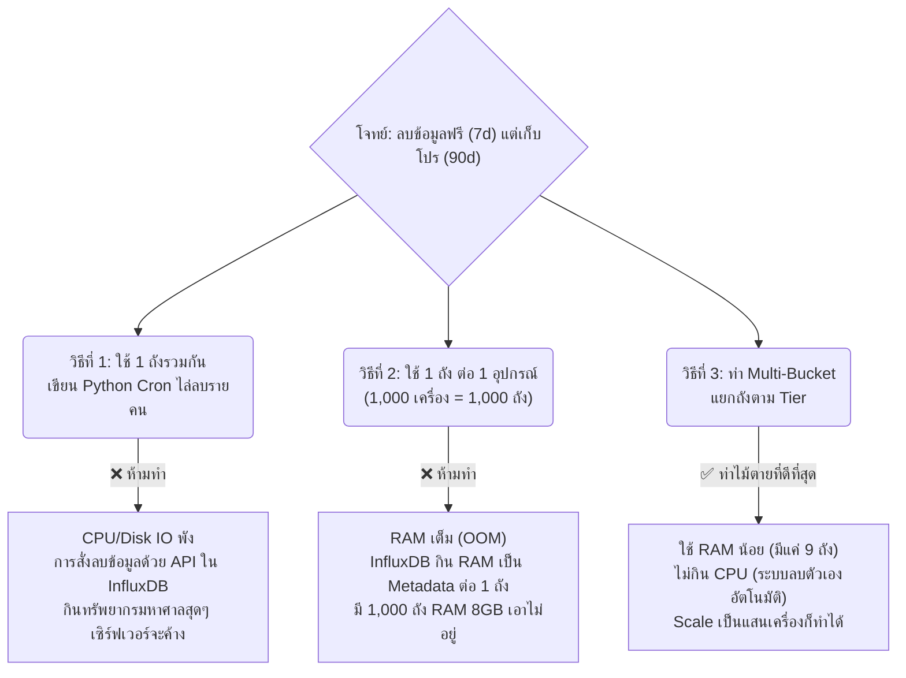
```mermaid
flowchart TD
    Start{"โจทย์: ลบข้อมูลฟรี (7d) แต่เก็บโปร (90d)"}
    
    Start --> M1("วิธีที่ 1: ใช้ 1 ถังรวมกัน<br/>เขียน Python Cron ไล่ลบรายคน")
    Start --> M2("วิธีที่ 2: ใช้ 1 ถัง ต่อ 1 อุปกรณ์<br/>(1,000 เครื่อง = 1,000 ถัง)")
    Start --> M3("วิธีที่ 3: ท่า Multi-Bucket<br/>แยกถังตาม Tier")
    
    M1 -->|❌ ห้ามทำ| R1["CPU/Disk IO พัง<br/>การสั่งลบข้อมูลด้วย API ใน InfluxDB<br/>กินทรัพยากรมหาศาลสุดๆ เซิร์ฟเวอร์จะค้าง"]
    M2 -->|❌ ห้ามทำ| R2["RAM เต็ม (OOM)<br/>InfluxDB กิน RAM เป็น Metadata ต่อ 1 ถัง<br/>มี 1,000 ถัง RAM 8GB เอาไม่อยู่"]
    
    M3 -->|✅ ท่าไม้ตายที่ดีที่สุด| R3["ใช้ RAM น้อย (มีแค่ 9 ถัง)<br/>ไม่กิน CPU (ระบบลบตัวเองอัตโนมัติ)<br/>Scale เป็นแสนเครื่องก็ทำได้"]
```
> **ข้อดีของ Multi-Bucket:** อาศัยจุดแข็งของ InfluxDB เรื่อง "Shard Dropping" ซึ่งเป็นการสลายไฟล์บนดิสก์ทิ้งทั้งก้อน (Zero CPU cost) แทนที่จะไล่ลบข้อมูลทีละบรรทัด (High CPU cost)

หากไม่ใช้วิธีแยก 3 Buckets ตาม Tier จะมีท่า (Approach) อื่นๆ ที่ทำได้ แต่มีข้อเสียที่ร้ายแรงดังนี้:

**❌ ทางเลือกที่ 1: ใช้แค่ 1 Bucket (ยัดรวมกัน) แล้วเขียนสคริปต์ไล่ลบเอง (Manual Cron Delete)**
* **วิธีทำ:** เก็บทุกเครื่องไว้ใน `power_data` แบบไม่จำกัดอายุ แล้วให้ Python รันทุกคืนตอนตี 3 ไปเช็คว่าเครื่องไหนเป็นสายฟรี ก็ให้ยิงคำสั่ง `influx delete` ลบข้อมูลที่เก่ากว่า 7 วันทิ้ง
* **ทำไมถึงพัง (จุดสลบ):** คำสั่งลบข้อมูล (`influx delete`) เป็นคำสั่งที่กินทรัพยากร (CPU & Disk IO) **มหาศาลที่สุด** ของ InfluxDB เพราะมันต้องไปแก้ไฟล์โครงสร้าง (TSM) บนดิสก์ใหม่หมด หากระบบมี 1,000 เครื่อง สคริปต์นี้อาจทำให้เซิร์ฟเวอร์ค้าง (Hang) หรือล่มทุกคืนตอนตี 3 ได้เลย

**❌ ทางเลือกที่ 2: สร้าง Bucket แยกให้ "รายเครื่อง" ไปเลย (1 Device = 1 Bucket)**
* **วิธีทำ:** มี 1,000 เครื่อง ก็สร้าง 1,000 Buckets ไปเลย อยากตั้งอายุเครื่องไหนกี่วันก็ตั้งได้อิสระสุดๆ
* **ทำไมถึงพัง (จุดสลบ):** InfluxDB จะใช้ RAM จำโครงสร้าง (Index/Metadata) ของแต่ละ Bucket เอาไว้ ยิ่งมี Bucket เยอะ ยิ่งกิน RAM ทวีคูณ หากสร้างเกิน 100-200 Buckets เซิร์ฟเวอร์จะ RAM เต็ม (OOM) และล่มทันที

**✅ สรุปเหตุผลที่ต้องใช้ "Multi-Bucket Routing (9 Buckets)":**
1. **มีถึง 9 Buckets กินทรัพยากร (RAM) ไหม?:** คำตอบคือ **"แทบไม่กินเลยครับ"** ใน InfluxDB สิ่งที่กิน RAM คือ "จำนวนอุปกรณ์ (Series Cardinality)" ไม่ใช่จำนวน Bucket การมี 9 Buckets กิน RAM เพิ่มขึ้นหลัก Kilobytes (เพื่อเก็บชื่อถัง) เท่านั้น เมื่อเทียบกับแพ็กเกจ **Hostinger KVM 2 ที่มี RAM 8 GB** ถือว่าขนหน้าแข้งไม่ร่วงเลยแม้แต่นิดเดียวครับ (InfluxDB จะเริ่มมีปัญหา OOM เมื่อมี Bucket แตะหลักพันถังขึ้นไป)
2. **Zero Maintenance (ไม่ต้องลบเอง):** อาศัยกลไก Retention อัตโนมัติ (Shard dropping) ของ InfluxDB ซึ่งเป็นการสลายข้อมูลทิ้งโดยไม่กิน CPU เลยแม้แต่นิดเดียว 
3. **การ Scale:** ต่อให้มีเครื่องเพิ่มเป็น 100,000 เครื่อง โครงสร้าง DB ก็ยังคงฟิกซ์ตายตัวอยู่ที่ 9 Buckets เหมือนเดิม ไม่เป็นภาระของระบบหลังบ้าน

---

## 5. ต้นทุน VPS Hosting สำหรับ InfluxDB

### 5.1 เปรียบเทียบผู้ให้บริการ VPS (อ้างอิงราคาปี 2025-2026)

การเลือกผู้ให้บริการ VPS มีผลอย่างมากต่อต้นทุนและประสิทธิภาพระยะยาว เราได้เปรียบเทียบผู้ให้บริการหลักๆ โดยอ้างอิงสเปคขั้นต่ำที่รัน InfluxDB 2.x ได้เสถียร (RAM 8GB):

| ผู้ให้บริการ | แพ็กเกจตัวอย่าง | vCPU / RAM | Storage | ราคาโดยประมาณ/เดือน | จุดเด่น | จุดด้อย |
|:---|:---|:---|:---|:---|:---|:---|
| **Hostinger** | KVM 2 | 2 / 8 GB | 100 GB NVMe | **~419 ฿** ($12) | มี Live Chat คุยง่าย, UI ใช้งานง่าย, NVMe เร็วมาก | ราคาหลังหมดโปรจะแพงขึ้น (ต้องดู Renewal price) |
| **Contabo** | Cloud VPS 20 | 6 / 12 GB | 200 GB SSD (หรือ 100 GB NVMe) | **~250 - 315 ฿** ($7.2 - $9) | ราคาถูกเมื่อเทียบกับสเปคที่ได้, ให้ RAM/Storage เยอะ | Overselling บ่อย (เครื่องอืดบางช่วง), Support ตอบช้า |
| **DigitalOcean** | Basic Premium | 2 / 8 GB | 160 GB NVMe | **~1,680 ฿** ($48) | ระบบนิ่งมาก, Scale ง่าย, เหมาะกับ Enterprise | ราคาแพงกว่า 4 เท่าเมื่อเทียบกับสเปคเดียวกัน |
| **AWS** | EC2 t3.large | 2 / 8 GB | 100 GB EBS | **~2,500+ ฿** ($70+) | เสถียรภาพสูงสุด, ระบบ Ecosystem สมบูรณ์แบบ | ราคาแพงที่สุด, โดนคิดค่า Bandwidth (Egress) เพิ่ม |

> **ทำไมถึงเลือก Hostinger?** 
> แม้ Contabo จะถูกกว่า แต่สำหรับระบบ IoT ที่ต้องรับข้อมูลตลอดเวลา (Real-time) เรื่องความเสถียร (Uptime) และความเร็วของ Disk (NVMe vs SSD) สำคัญมาก Hostinger KVM 2 ให้ความสมดุลระหว่าง "ประสิทธิภาพ" และ "ราคา" ได้ดีที่สุด และมี Live Chat ที่ช่วยเหลือได้รวดเร็วกว่า
>
> 💡 **หมายเหตุ: เซิร์ฟเวอร์เดียวรันหมดเลยได้ไหม? (All-in-One VPS)**
> คำตอบคือ **"เอาอยู่สบายครับ"** บน Hostinger KVM VPS เครื่องเดียวนั้น เราสามารถติดตั้งและรันฐานข้อมูลทั้งหมด (InfluxDB + PostgreSQL + Redis) รวมถึงตัวรับข้อมูล (Telegraf + Mosquitto) และ Backend API กองรวมไว้ในเครื่องเดียวกันได้เลย (ผ่าน Docker) แพ็คเกจอย่าง KVM 2 หรือ KVM 4 มี RAM และ CPU เหลือเฟือที่จะรับมือบริการทั้งหมดนี้พร้อมกันสำหรับลูกค้า 1,000 เครื่องแรกได้อย่างชิลๆ ครับ นี่คือข้อดีสูงสุดของการทำ Self-hosted

### 5.2 เจาะลึกแพ็กเกจของ Hostinger (เพื่อรองรับการ Scale)

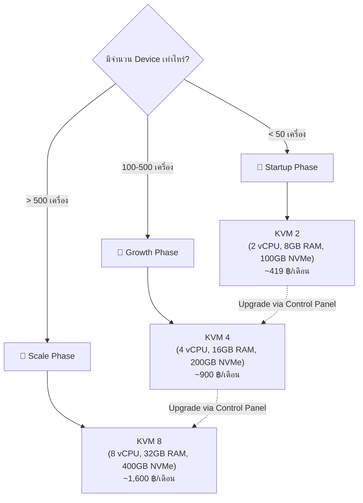
```mermaid
flowchart TD
    Start{"มีจำนวน Device เท่าไหร่?"}
    
    Start -->|"< 50 เครื่อง"| S1["📌 Startup Phase"]
    Start -->|"100-500 เครื่อง"| S2["📌 Growth Phase"]
    Start -->|"> 500 เครื่อง"| S3["📌 Scale Phase"]
    
    S1 --> VPS1["KVM 2<br/>(2 vCPU, 8GB RAM, 100GB NVMe)<br/>~419 ฿/เดือน"]
    S2 --> VPS2["KVM 4<br/>(4 vCPU, 16GB RAM, 200GB NVMe)<br/>~900 ฿/เดือน"]
    S3 --> VPS3["KVM 8<br/>(8 vCPU, 32GB RAM, 400GB NVMe)<br/>~1,600 ฿/เดือน"]
    
    VPS1 -. "Upgrade via Control Panel" .-> VPS2
    VPS2 -. "Upgrade via Control Panel" .-> VPS3
```
> **ข้อดี:** แผนภาพแสดงให้เห็นว่าการอัปเกรด (Scale up) บน Hostinger ทำได้ง่ายแค่คลิกเดียว ไม่ต้องย้ายข้อมูลเอง
> **ข้อเสีย:** เมื่อ Scale ไปจนสุด KVM 8 แล้ว หากต้องรับโหลดมากกว่านั้น จะต้องหันไปใช้ Load Balancer และ Scale out (เพิ่มเครื่อง) แทน

หลังจากปรับกลยุทธ์มาใช้ **Hostinger** เป็นผู้ให้บริการหลัก (ด้วยข้อดีเรื่อง Live Chat Support และ UI ที่ใช้งานง่าย) โดยเราจะอ้างอิง **ราคาต่ออายุ (Renewal Price)** เพื่อให้การวิเคราะห์ธุรกิจสะท้อนต้นทุนระยะยาวที่แท้จริง:

| แพ็กเกจ Hostinger | vCPU | RAM | Storage (NVMe) | ราคาเริ่มต้น (โปรฯ)* | ราคาต่ออายุ (Renewal) | เหมาะสำหรับ |
|:------------------|:-----|:----|:---------------|:--------------------|:----------------------|:------------|
| **KVM 2** | 2 | 8 GB | 100 GB | ~269 ฿/เดือน | **~419 ฿/เดือน** | ช่วงเริ่มต้น (Startup) |
| **KVM 4** | 4 | 16 GB | 200 GB | ~450 ฿/เดือน | **~900 ฿/เดือน** | ช่วงขยายตัว (Growth) |
| **KVM 8** | 8 | 32 GB | 400 GB | ~850 ฿/เดือน | **~1,600 ฿/เดือน** | ช่วงรับโหลดหนัก (Scale) |

> *หมายเหตุ: ราคาโปรโมชัน (เช่น 269 ฿/เดือน สำหรับ KVM 2) มักจะต้องจ่ายล่วงหน้า 24-48 เดือน ในเอกสารฉบับนี้จะคำนวณต้นทุน/กำไร โดยอ้างอิงจาก **ราคาต่ออายุ (419 ฿)** เพื่อความปลอดภัยในการประเมินธุรกิจ (Worst-case scenario)

### 5.3 เปรียบเทียบการตั้งเซิร์ฟเวอร์เอง (Self-hosted) vs ใช้บริการ Cloud สำเร็จรูป (Managed Cloud)

| รายการ | Self-hosted (เช่า VPS ของ Hostinger) | Managed Cloud (ใช้บริการ InfluxDB Cloud) |
|:-------|:-------------------------------------|:------------------------------------------|
| **ราคา 100 devices/เดือน** | ~419 ฿ (KVM 2) | ~$1,200+ (~42,000 ฿) |
| **ราคา 1,000 devices/เดือน** | ~900 ฿ (KVM 4) | ~$12,000+ (~420,000 ฿) |
| **ข้อดี** | ราคาคงที่, ควบคุมข้อมูลลูกค้าได้เอง 100%, มี Live Chat ภาษาไทย | ไม่ต้องตั้งค่าเซิร์ฟเวอร์, ไม่ต้องดูแลเอง |
| **ข้อเสีย** | ต้องดูแลเซิร์ฟเวอร์และระบบ Backup เอง | ราคาแพงหฤโหดเมื่อปริมาณข้อมูล IoT เพิ่มขึ้น |
| **เหมาะกับใคร** | ✅ **PowerView (ผลิตเครื่องเองและมีทีมดูแลระบบ)** | องค์กรใหญ่ที่ไม่มีทีม DevOps แต่มีงบประมาณมหาศาล |

### 5.4 ✅ ข้อสรุปและแพ็กเกจที่แนะนำ

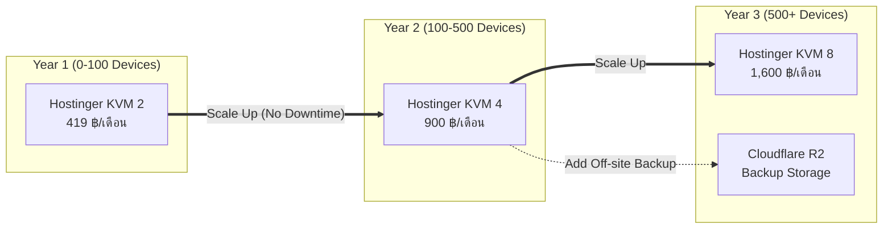
```mermaid
flowchart LR
    subgraph Year1 ["Year 1 (0-100 Devices)"]
        Y1_S["Hostinger KVM 2<br/>419 ฿/เดือน"]
    end
    subgraph Year2 ["Year 2 (100-500 Devices)"]
        Y2_S["Hostinger KVM 4<br/>900 ฿/เดือน"]
    end
    subgraph Year3 ["Year 3 (500+ Devices)"]
        Y3_S["Hostinger KVM 8<br/>1,600 ฿/เดือน"]
        Y3_R["Cloudflare R2<br/>Backup Storage"]
    end
    
    Y1_S ==>|"Scale Up (No Downtime)"| Y2_S
    Y2_S ==>|"Scale Up"| Y3_S
    Y2_S -. "Add Off-site Backup" .-> Y3_R
```
> **ข้อดี:** แสดงเส้นทางการเติบโต (Growth Path) ชัดเจนว่าในช่วงแรกสามารถเริ่มด้วยงบเพียง 419 บาท และค่อยอัปเกรดเมื่อมีรายได้เข้ามาครอบคลุมแล้ว
> **ข้อเสีย:** หากลูกค้าเพิ่มขึ้นแบบก้าวกระโดด (Spike) อาจจะต้องอัปเกรดข้ามแพ็กเกจทันที

**สรุปการตัดสินใจ:** แนะนำให้เลือกวิธี **"Self-hosted โดยเช่าเครื่อง VPS จาก Hostinger"** 

#### สำหรับช่วง Startup (ปัจจุบัน, 7-50 devices)
**→ แนะนำแพ็กเกจ: Hostinger KVM 2 (~419 ฿/เดือน)**
* 2 vCPU: เพียงพอสำหรับการทำงานพื้นฐานของ InfluxDB, Node.js Gateway และ PostgreSQL
* 8 GB RAM: สำคัญมากสำหรับ InfluxDB TSM Engine ในการทำแคช Index ของอุปกรณ์ 50 เครื่อง
* 100 GB NVMe: รับข้อมูลดิบ 50 เครื่อง (เดือนละ ~10 GB) ได้เหลือเฟือ

#### สำหรับช่วง Growth (100-500 devices)
**→ Hostinger KVM 4 (~900 ฿/เดือน)** (เพิ่ม RAM เป็น 16GB เพื่อรองรับ Series Cardinality ที่เพิ่มขึ้น)

#### สำหรับช่วง Scale (500-2,000 devices)
**→ Hostinger KVM 8 (~1,600 ฿/เดือน)**

### 5.4 คำแนะนำการเลือก OS และ Control Panel (Apps & Panels)

เมื่อทำการสั่งซื้อ VPS ระบบจะมีให้เลือก OS และ Control Panel (แผงควบคุมเซิร์ฟเวอร์) สำหรับโปรเจกต์ PowerView **เราไม่จำเป็นต้องเสียเงินซื้อ Panel ใดๆ เลย** เนื่องจากเราใช้ Docker เป็นหลัก:

| ประเภท | ตัวเลือก | ราคา | เหตุผลที่เลือก / ไม่เลือก |
|:-------|:---------|:-----|:------------------------|
| **OS (ระบบปฏิบัติการ)** | **Ubuntu 22.04 / 24.04 LTS** | **ฟรี** | เป็นมาตรฐานอุตสาหกรรม เสถียรที่สุด และเข้ากันได้ดีเยี่ยมกับ Docker (แนะนำให้เลือก) |
| | Windows Server 2022 | เสียเงิน (แพงมาก) | ไม่จำเป็นและกินทรัพยากร (RAM/CPU) ของเครื่องโดยเปล่าประโยชน์ |
| **Control Panel (ฟรี)** | **Docker CE** | **ฟรี** | โปรเจกต์ PowerView รันบน Docker 100% อยู่แล้ว การเลือกข้อนี้ระบบจะลง Ubuntu + Docker ให้พร้อมใช้ทันที (แนะนำให้เลือก) |
| | CyberPanel, aaPanel, Webmin | **ฟรี** | เป็น Panel สำหรับจัดการ Web Hosting ทั่วไป ไม่ตรงกับ Use case ของระบบ IoT เรา |
| **Control Panel (เสียเงิน)**| **cPanel, Plesk, DirectAdmin** | เสียเงิน (รายเดือน) | เป็น Panel สำหรับบริษัทรับทำเว็บ (Shared Hosting) ไม่มีความจำเป็นต้องใช้ และจะทำให้หนักเครื่องเปล่าๆ |

**👉 สรุปตอนกดสั่งซื้อ:** ในช่อง Image ให้เลือกหมวด **Apps & Panels** แล้วกดเลือก **Docker** (ระบบจะลง Ubuntu + Docker มาให้ฟรี ไม่บวกราคาเพิ่มครับ)

---

## 6. การวิเคราะห์ต้นทุนข้อมูลแยกตาม Tier และจำนวนอุปกรณ์ (Scale Analysis)

เอกสารส่วนนี้สรุปตัวเลขปริมาณข้อมูลที่ขยายตัวสูงสุด (Max Storage) และต้นทุนค่าเซิร์ฟเวอร์เฉลี่ยต่อเครื่อง สำหรับโมเดลธุรกิจ IoT ของ PowerView ครบทั้ง 3 ระดับ: **Free, Pro, และ Enterprise** 

### 6.1 ข้อมูลพื้นฐานที่ใช้ในการคำนวณ (Base Metrics)

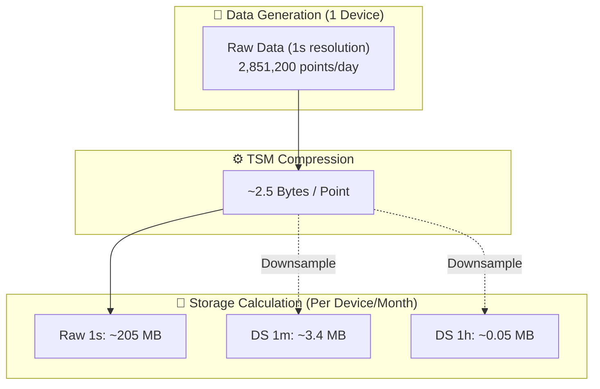
```mermaid
flowchart TD
    subgraph Data_Generation ["📡 Data Generation (1 Device)"]
        Raw["Raw Data (1s resolution)<br/>2,851,200 points/day"]
    end
    
    subgraph Compression ["⚙️ TSM Compression"]
        Comp["~2.5 Bytes / Point"]
    end
    
    subgraph Storage_Cost ["💾 Storage Calculation (Per Device/Month)"]
        S_Raw["Raw 1s: ~205 MB"]
        S_DS1m["DS 1m: ~3.4 MB"]
        S_DS1h["DS 1h: ~0.05 MB"]
    end
    
    Raw --> Comp
    Comp --> S_Raw
    Comp -. "Downsample" .-> S_DS1m
    Comp -. "Downsample" .-> S_DS1h
```
> **ข้อดี:** ทำให้เห็นว่าข้อมูลตั้งต้นจาก Device มหาศาลมาก แต่ถูกบีบอัดจนเหลือขนาดที่รับได้ (205 MB/เดือน) เป็นที่มาของตัวเลขคำนวณ
> **ข้อเสีย:** หากมีการเพิ่ม Field (มากกว่า 33 fields) ในอนาคต ตัวเลขทุกอย่างในตารางนี้จะเปลี่ยนทั้งหมด

- **ความถี่ในการส่ง:** 1 วินาที (86,400 จุด/วัน)
- **ขนาดข้อมูลหลังบีบอัด (InfluxDB Compression):** ~2.5 bytes / point
- **ข้อมูลดิบ (Raw Data):** ~205 MB / เครื่อง / เดือน (หรือ ~6.8 MB/วัน)
- **ข้อมูลบีบอัดเฉลี่ยรายนาที (DS 1m):** ~3.4 MB / เครื่อง / เดือน
- **ข้อมูลบีบอัดเฉลี่ยรายชั่วโมง (DS 1h):** ~0.05 MB / เครื่อง / เดือน
- **ราคาอ้างอิงพื้นที่เซิร์ฟเวอร์ (NVMe):** อิงจากแพ็กเกจ Hostinger KVM 2 เฉลี่ยพื้นที่ **1 GB = ประมาณ 4.2 บาท/เดือน**

### 6.2 ปริมาณพื้นที่จัดเก็บสูงสุด (Max Storage) ต่อ 1 อุปกรณ์

เมื่ออุปกรณ์ทำงานจนถึงจุดที่ข้อมูลเก่าถูกลบทิ้งหมุนเวียนไปเรื่อยๆ (Max Retention) พื้นที่ดิสก์ของ 1 อุปกรณ์จะตันอยู่ที่:

| รายการ | Free Tier | Pro Tier | Enterprise Tier |
|:-------|:----------|:---------|:----------------|
| **ก้อนที่ 1: ข้อมูลดิบ (Raw)** | 47.8 MB *(7 วัน)* | 615 MB *(90 วัน)* | 2,494 MB *(1 ปี)* |
| **ก้อนที่ 2: ข้อมูลเฉลี่ย 1 นาที** | 3.4 MB *(30 วัน)* | 41 MB *(1 ปี)* | 204 MB *(จำลอง 5 ปี)* |
| **ก้อนที่ 3: ข้อมูลเฉลี่ย 1 ชั่วโมง**| 0.6 MB *(1 ปี)* | 1.8 MB *(3 ปี)* | 6 MB *(จำลอง 10 ปี)* |
| **รวมพื้นที่ทั้งหมด ต่อ 1 เครื่อง** | **~52 MB (0.05 GB)** | **~658 MB (0.66 GB)** | **~2,704 MB (2.71 GB)** |

### 6.3 ตารางวิเคราะห์ต้นทุนรวม ตามจำนวนอุปกรณ์

> **หมายเหตุ:** 
> - **สเปกเริ่มต้น:** KVM 2 (419 ฿) รองรับพื้นที่ InfluxDB ได้ราวๆ 80GB (หัก OS ออกแล้ว)
> - **ต้นทุน/เครื่อง** เป็นแค่ค่าพื้นที่จัดเก็บเท่านั้น ไม่รวมค่าแรง หรือค่าการตลาด

#### 🟢 กลุ่มผู้ใช้ฟรี (Free Tier) — เก็บข้อมูลแค่ 7 วัน
*เป้าหมาย: ต้นทุนต่ำที่สุด เพื่อใช้เป็นตัวดึงดูดลูกค้า*

| จำนวน Devices | พื้นที่ข้อมูลรวม | เซิร์ฟเวอร์ที่ต้องใช้ | ค่าใช้จ่ายรวม/เดือน | ต้นทุนเฉลี่ย / เครื่อง |
|:--------------|:----------------|:---------------------|:--------------------|:-----------------------|
| **1** | 0.05 GB | KVM 2 | 419 ฿ *(ขั้นต่ำ)* | 419 ฿ |
| **100** | 5.2 GB | KVM 2 | 419 ฿ | **4.19 ฿** |
| **500** | 26.0 GB | KVM 2 | 419 ฿ | **0.84 ฿** |
| **1,000** | 52.0 GB | KVM 2 | 419 ฿ | **0.42 ฿** |
| **📌 MAX KVM 2 (~1,538 เครื่อง)** | 80.0 GB | KVM 2 | 419 ฿ | **0.27 ฿** |
| **📌 MAX KVM 4 (~3,461 เครื่อง)** | 180.0 GB | KVM 4 | 900 ฿ | **0.26 ฿** |
| **📌 MAX KVM 8 (~7,307 เครื่อง)** | 380.0 GB | KVM 8 | 1,600 ฿ | **0.22 ฿** |
| **10,000** | 520.0 GB | VPS Cluster | ~3,200 ฿ | **0.32 ฿** |

#### 🔵 กลุ่มผู้ใช้ทั่วไป (Pro Tier: 99 ฿/เดือน) — เก็บข้อมูลดิบ 90 วัน
*เป้าหมาย: ทำกำไรหลักให้บริษัท (Cash Cow)*

| จำนวน Devices | พื้นที่ข้อมูลรวม | เซิร์ฟเวอร์ที่ต้องใช้ | ค่าใช้จ่ายรวม/เดือน | ต้นทุนเฉลี่ย / เครื่อง |
|:--------------|:----------------|:---------------------|:--------------------|:-----------------------|
| **1** | 0.66 GB | KVM 2 | 419 ฿ *(ขั้นต่ำ)* | 419 ฿ |
| **100** | 65.8 GB | KVM 2 | 419 ฿ | **4.19 ฿** |
| **📌 MAX KVM 2 (~121 เครื่อง)** | 80.0 GB | KVM 2 | 419 ฿ | **3.46 ฿** |
| **📌 MAX KVM 4 (~273 เครื่อง)** | 180.0 GB | KVM 4 | 900 ฿ | **3.29 ฿** |
| **500** | 329.0 GB | KVM 8 | ~1,600 ฿ | **3.20 ฿** |
| **📌 MAX KVM 8 (~577 เครื่อง)** | 380.0 GB | KVM 8 | 1,600 ฿ | **2.77 ฿** |
| **1,000** | 658.0 GB | KVM Cluster | ~3,200 ฿ | **3.20 ฿** |
| **5,000** | 3.29 TB (3,290 GB)| Bare Metal / Cloud | ~16,000 ฿ | **3.20 ฿** |
| **10,000** | 6.58 TB (6,580 GB)| Bare Metal / Cloud | ~32,000 ฿ | **3.20 ฿** |

> **ความคุ้มค่า (Profit Margin):** ต้นทุนข้อมูลของลูกค้า Pro อยู่ที่ประมาณ 3.20 บาท ในขณะที่คุณเก็บค่าบริการ 99 บาท/เดือน กำไรขั้นต้นส่วนนี้จะสูงกว่า **96%** 

#### 🟣 กลุ่มองค์กร (Enterprise Tier: 490 ฿/เดือน) — เก็บข้อมูลดิบ 1 ปี
*เป้าหมาย: เน้นบริการ Data ระยะยาวให้โรงงาน/องค์กรขนาดใหญ่*

| จำนวน Devices | พื้นที่ข้อมูลรวม | เซิร์ฟเวอร์ที่ต้องใช้ | ค่าใช้จ่ายรวม/เดือน | ต้นทุนเฉลี่ย / เครื่อง |
|:--------------|:----------------|:---------------------|:--------------------|:-----------------------|
| **1** | 2.70 GB | KVM 2 | 419 ฿ *(ขั้นต่ำ)* | 419 ฿ |
| **📌 MAX KVM 2 (~29 เครื่อง)** | 80.0 GB | KVM 2 | 419 ฿ | **14.44 ฿** |
| **📌 MAX KVM 4 (~66 เครื่อง)** | 180.0 GB | KVM 4 | 900 ฿ | **13.63 ฿** |
| **100** | 270.4 GB | KVM 8 | ~1,600 ฿ | **16.0 ฿** |
| **📌 MAX KVM 8 (~140 เครื่อง)** | 380.0 GB | KVM 8 | 1,600 ฿ | **11.42 ฿** |
| **500** | 1.35 TB | KVM Cluster | ~8,000 ฿ | **16.0 ฿** |
| **1,000** | 2.70 TB | Bare Metal / Cloud | ~16,000 ฿ | **16.0 ฿** |
| **5,000** | 13.52 TB | Enterprise Cloud | ~80,000 ฿ | **16.0 ฿** |
| **10,000** | 27.04 TB | Enterprise Cloud | ~160,000 ฿ | **16.0 ฿** |

> **ความคุ้มค่า (Profit Margin):** ต้นทุนข้อมูลองค์กรอยู่ที่ 16.0 บาท ในขณะที่คุณเก็บค่าบริการ 490 บาท/เดือน (หรือมากกว่า) กำไรขั้นต้นส่วนนี้ยังคงสูงมากถึง **96%** 

### 6.4 การจำลองสัดส่วนผู้ใช้งานตามความเป็นจริง (Mixed-Tier Simulation)

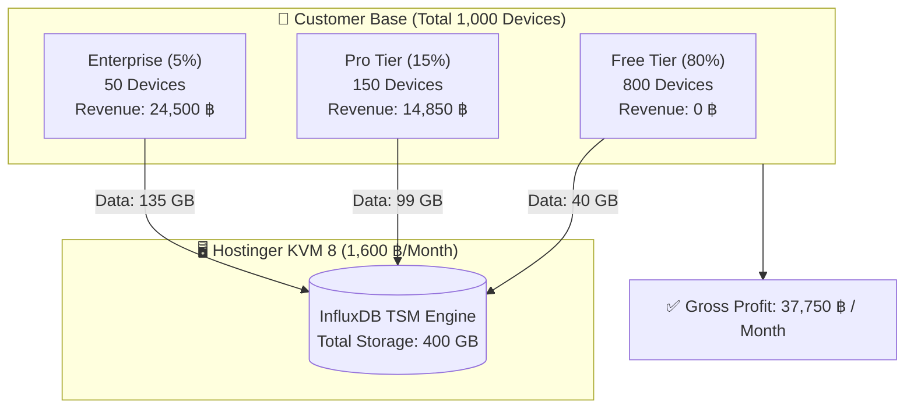
```mermaid
flowchart TD
    subgraph VPS ["🖥️ Hostinger KVM 8 (1,600 ฿/Month)"]
        direction LR
        DB[("InfluxDB TSM Engine<br/>Total Storage: 400 GB")]
    end
    
    subgraph Users ["👥 Customer Base (Total 1,000 Devices)"]
        U_Free["Free Tier (80%)<br/>800 Devices<br/>Revenue: 0 ฿"]
        U_Pro["Pro Tier (15%)<br/>150 Devices<br/>Revenue: 14,850 ฿"]
        U_Ent["Enterprise (5%)<br/>50 Devices<br/>Revenue: 24,500 ฿"]
    end
    
    U_Free -- "Data: 40 GB" --> DB
    U_Pro -- "Data: 99 GB" --> DB
    U_Ent -- "Data: 135 GB" --> DB
    
    Profit["✅ Gross Profit: 37,750 ฿ / Month"]
    Users --> Profit
```
> **ข้อดี:** แผนภาพแสดงให้เห็นหลักการ **"คนจ่ายเงินอุดหนุนคนใช้ฟรี"** (Cross-subsidy) แม้คนใช้ฟรีจะเยอะถึง 80% แต่ข้อมูลรวมกันใช้ Storage นิดเดียว และรายได้จาก Pro/Enterprise ครอบคลุมต้นทุน VPS ไปไกลแล้ว
> **ข้อเสีย:** หากสัดส่วนคนใช้ฟรีพุ่งไปถึง 95-99% โมเดลธุรกิจนี้อาจขาดทุนได้ทันที จึงต้องบังคับให้ลูกค้าซื้อเครื่องอย่างต่อเนื่อง

ในสถานการณ์จริง เซิร์ฟเวอร์ 1 เครื่องจะรับภาระปะปนกันทั้งลูกค้า Free, Pro และ Enterprise ตารางนี้จำลองสัดส่วนตามความเป็นจริง (ลูกค้าส่วนใหญ่ใช้ฟรี, บางส่วนจ่ายรายเดือน, และส่วนน้อยเป็นองค์กร) เพื่อให้เห็น **"กำไรสุทธิ"** และความต้องการเซิร์ฟเวอร์ที่แท้จริง

#### 📊 สถานการณ์ที่ 1: ช่วงเริ่มต้น (Startup) — รวม 300 Devices
*สัดส่วนสมมติ: Free 250 เครื่อง (83%), Pro 35 เครื่อง (12%), Enterprise 15 เครื่อง (5%)*

| Tier | จำนวน | พื้นที่/เครื่อง | พื้นที่รวม | รายได้ที่เก็บลูกค้า/เดือน |
|:-----|:------|:----------------|:-----------|:--------------------------|
| **Free** | 250 | 0.05 GB | 12.5 GB | 0 ฿ |
| **Pro** (99฿) | 35 | 0.66 GB | 23.1 GB | 3,465 ฿ |
| **Enterprise** (490฿)| 15 | 2.71 GB | 40.6 GB | 7,350 ฿ |
| **รวมทั้งหมด** | **300**| - | **76.2 GB**| **10,815 ฿ / เดือน** |

- **ทรัพยากรที่ต้องใช้:** `KVM 2` (ราคา 419 ฿/เดือน, ได้พื้นที่ NVMe 100 GB ซึ่งครอบคลุม 76.2 GB ได้พอดี)
- **กำไรขั้นต้น (Gross Profit):** 10,815 - 419 = **10,396 ฿ / เดือน (กำไร ~96%)**

#### 📊 สถานการณ์ที่ 2: ช่วงเติบโต (Growth) — รวม 1,000 Devices
*สัดส่วนสมมติ: Free 800 เครื่อง (80%), Pro 150 เครื่อง (15%), Enterprise 50 เครื่อง (5%)*

| Tier | จำนวน | พื้นที่/เครื่อง | พื้นที่รวม | รายได้ที่เก็บลูกค้า/เดือน |
|:-----|:------|:----------------|:-----------|:--------------------------|
| **Free** | 800 | 0.05 GB | 40.0 GB | 0 ฿ |
| **Pro** (99฿) | 150 | 0.66 GB | 99.0 GB | 14,850 ฿ |
| **Enterprise** (490฿)| 50 | 2.71 GB | 135.5 GB | 24,500 ฿ |
| **รวมทั้งหมด** | **1,000**| - | **274.5 GB**| **39,350 ฿ / เดือน** |

- **ทรัพยากรที่ต้องใช้:** `KVM 8` (ต้นทุน 1,600 ฿/เดือน, พื้นที่ 400 GB)
- **กำไรขั้นต้น (Gross Profit):** 39,350 - 1,600 = **37,750 ฿ / เดือน (กำไร ~95%)**

#### 📊 สถานการณ์ที่ 3: ช่วงขยายตัว (Scale) — รวม 5,000 Devices
*สัดส่วนสมมติ: Free 4,000 เครื่อง (80%), Pro 750 เครื่อง (15%), Enterprise 250 เครื่อง (5%)*

| Tier | จำนวน | พื้นที่/เครื่อง | พื้นที่รวม | รายได้ที่เก็บลูกค้า/เดือน |
|:-----|:------|:----------------|:-----------|:--------------------------|
| **Free** | 4,000 | 0.05 GB | 200.0 GB | 0 ฿ |
| **Pro** (99฿) | 750 | 0.66 GB | 495.0 GB | 74,250 ฿ |
| **Enterprise** (490฿)| 250 | 2.71 GB | 677.5 GB | 122,500 ฿ |
| **รวมทั้งหมด** | **5,000**| - | **1,372.5 GB (1.37 TB)**| **196,750 ฿ / เดือน** |

- **ทรัพยากรที่ต้องใช้:** `VPS Cluster / Bare Metal Server` (ต้นทุนรวมประมาณ 8,000 ฿/เดือน)
- **กำไรขั้นต้น (Gross Profit):** 196,750 - 8,000 = **188,750 ฿ / เดือน (กำไร ~95%)**

### 6.5 บทสรุปเชิงธุรกิจ (Executive Summary)

1. **Free Tier:** ด้วยการตั้งค่าให้ลบข้อมูลทุก 7 วัน ทำให้พื้นที่ข้อมูลหยุดพอกพูนที่ 52 MB/เครื่อง ทำให้บริษัทแบกรับต้นทุนลูกค้าฟรีได้ในระดับ **~30-40 สตางค์/เครื่อง** (มีลูกค้าฟรีหมื่นคน ก็จ่ายค่าเซิร์ฟเวอร์แค่ 3-4 พันบาท)
2. **Pro Tier:** ข้อมูล 90 วันจะตันที่ 658 MB/เครื่อง ต้นทุนตก **3.20 บาท** เทียบกับค่ารายเดือนที่เก็บ 99 บาท ถือว่าคุ้มทุนตั้งแต่คนแรกที่สมัคร
3. **Enterprise Tier:** การเก็บข้อมูล 1 ปี ใช้พื้นที่ 2.71 GB ต้นทุนพุ่งขึ้นเป็น **16 บาท** แต่เนื่องจากเราเก็บค่าบริการกลุ่มนี้สูง (490 ฿) ทำให้กลายเป็น Tier ที่ดึงเงินเข้าบริษัทได้มากที่สุดต่อเครื่อง

### 6.6 ต้นทุนอื่นๆ ที่ต้องพิจารณาเพิ่มเติม

| รายการ | ต้นทุนโดยประมาณ | หมายเหตุ |
|:-------|:-----------------|:---------|
| **MQTT Broker** | รวมใน VPS เดียวกัน | Mosquitto ใช้ RAM น้อยมาก |
| **Bandwidth** | Hostinger: 8 TB - 32 TB | เพียงพอต่อการส่งข้อมูล Time-series ปกติ |
| **Backup Storage** | Object Storage ~$5/เดือน (~175 ฿) | S3-compatible, เก็บ backup รายสัปดาห์ |
| **Domain + SSL** | ฟรี (Let's Encrypt) | ต่ออายุอัตโนมัติ |
| **Monitoring** | ฟรี (Grafana / Prometheus) | Self-hosted |

---

## 7. การออกแบบฐานข้อมูลเพิ่มเติมสำหรับ Billing

> **ทำไมต้องเพิ่มตารางใน PostgreSQL แทนที่จะเก็บข้อมูล Billing ลงใน InfluxDB ด้วย?**
> * **InfluxDB ออกแบบมาสำหรับ Time-Series (ข้อมูลที่ไหลเข้ามาตลอดเวลา)** ไม่ได้ออกแบบมาให้ทำ Relational Query เช่น "หา Subscription ที่หมดอายุภายใน 7 วัน แล้ว JOIN กับ User เพื่อส่งอีเมลแจ้งเตือน" คำสั่งแบบนี้ทำได้ยากมากใน InfluxDB แต่ทำได้ง่ายมากใน SQL (PostgreSQL)
> * **ข้อมูลการเงินต้องการ ACID Transaction:** การอัปเดต `PAYMENTS.status` จาก `pending` → `completed` พร้อมกับอัปเดต `DEVICE_SUBSCRIPTIONS.expires_at` ต้องเกิดขึ้นพร้อมกันแบบ Atomic (ห้ามอัปเดตแค่อันเดียวแล้วอีกอันค้าง) → PostgreSQL รองรับ Transaction ระดับนี้ InfluxDB ไม่มี
> * **ทางเลือกอื่น:** MongoDB ก็ทำได้ แต่ไม่มี Strong ACID เท่า PostgreSQL (MongoDB มี Transaction ตั้งแต่ v4.0 แต่ complexity สูงกว่าและ community support น้อยกว่า PostgreSQL ในด้าน Financial data)

### 7.1 Schema ใหม่ที่ต้องเพิ่มใน PostgreSQL

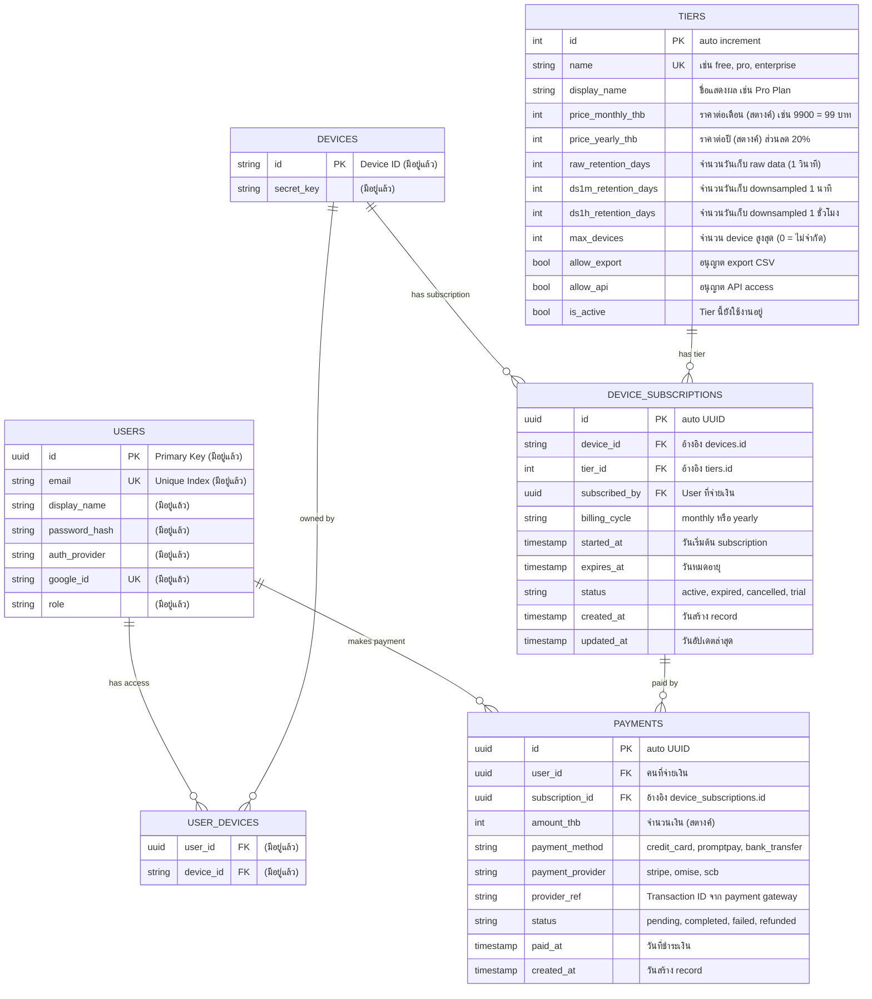
```mermaid
erDiagram
    USERS ||--o{ USER_DEVICES : "has access"
    DEVICES ||--o{ USER_DEVICES : "owned by"
    DEVICES ||--o{ DEVICE_SUBSCRIPTIONS : "has subscription"
    USERS ||--o{ PAYMENTS : "makes payment"
    DEVICE_SUBSCRIPTIONS ||--o{ PAYMENTS : "paid by"
    TIERS ||--o{ DEVICE_SUBSCRIPTIONS : "has tier"

    USERS {
        uuid id PK "Primary Key (มีอยู่แล้ว)"
        string email UK "Unique Index (มีอยู่แล้ว)"
        string display_name "(มีอยู่แล้ว)"
        string password_hash "(มีอยู่แล้ว)"
        string auth_provider "(มีอยู่แล้ว)"
        string google_id UK "(มีอยู่แล้ว)"
        string role "(มีอยู่แล้ว)"
    }

    DEVICES {
        string id PK "Device ID (มีอยู่แล้ว)"
        string secret_key "(มีอยู่แล้ว)"
    }

    TIERS {
        int id PK "auto increment"
        string name UK "เช่น free, pro, enterprise"
        string display_name "ชื่อแสดงผล เช่น Pro Plan"
        int price_monthly_thb "ราคาต่อเดือน (สตางค์) เช่น 9900 = 99 บาท"
        int price_yearly_thb "ราคาต่อปี (สตางค์) ส่วนลด 20%"
        int raw_retention_days "จำนวนวันเก็บ raw data (1 วินาที)"
        int ds1m_retention_days "จำนวนวันเก็บ downsampled 1 นาที"
        int ds1h_retention_days "จำนวนวันเก็บ downsampled 1 ชั่วโมง"
        int max_devices "จำนวน device สูงสุด (0 = ไม่จำกัด)"
        bool allow_export "อนุญาต export CSV"
        bool allow_api "อนุญาต API access"
        bool is_active "Tier นี้ยังใช้งานอยู่"
    }

    DEVICE_SUBSCRIPTIONS {
        uuid id PK "auto UUID"
        string device_id FK "อ้างอิง devices.id"
        int tier_id FK "อ้างอิง tiers.id"
        uuid subscribed_by FK "User ที่จ่ายเงิน"
        string billing_cycle "monthly หรือ yearly"
        timestamp started_at "วันเริ่มต้น subscription"
        timestamp expires_at "วันหมดอายุ"
        string status "active, expired, cancelled, trial"
        timestamp created_at "วันสร้าง record"
        timestamp updated_at "วันอัปเดตล่าสุด"
    }

    PAYMENTS {
        uuid id PK "auto UUID"
        uuid user_id FK "คนที่จ่ายเงิน"
        uuid subscription_id FK "อ้างอิง device_subscriptions.id"
        int amount_thb "จำนวนเงิน (สตางค์)"
        string payment_method "credit_card, promptpay, bank_transfer"
        string payment_provider "stripe, omise, scb"
        string provider_ref "Transaction ID จาก payment gateway"
        string status "pending, completed, failed, refunded"
        timestamp paid_at "วันที่ชำระเงิน"
        timestamp created_at "วันสร้าง record"
    }

    USER_DEVICES {
        uuid user_id FK "(มีอยู่แล้ว)"
        string device_id FK "(มีอยู่แล้ว)"
    }
```

### 7.2 สรุปจุดประสงค์ของแต่ละตาราง & ฟิลด์

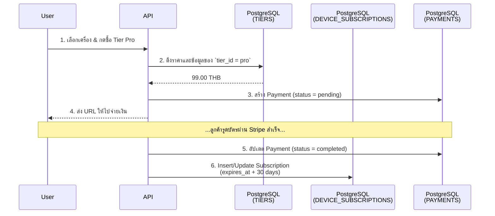
```mermaid
sequenceDiagram
    participant User
    participant API
    participant PG as PostgreSQL<br/>(TIERS)
    participant Sub as PostgreSQL<br/>(DEVICE_SUBSCRIPTIONS)
    participant Pay as PostgreSQL<br/>(PAYMENTS)
    
    User->>API: 1. เลือกเครื่อง & กดซื้อ Tier Pro
    API->>PG: 2. ดึงราคาและข้อมูลของ `tier_id = pro`
    PG-->>API: 99.00 THB
    API->>Pay: 3. สร้าง Payment (status = pending)
    API-->>User: 4. ส่ง URL ให้ไปจ่ายเงิน
    
    Note over User,Pay: ...ลูกค้ารูดบัตรผ่าน Stripe สำเร็จ...
    
    API->>Pay: 5. อัปเดต Payment (status = completed)
    API->>Sub: 6. Insert/Update Subscription<br/>(expires_at + 30 days)
```
> **ข้อดี:** การแยกตาราง Subscriptions ออกจาก Payments ช่วยให้ระบบสามารถมี "1 Subscription" ที่ถูกต่ออายุโดย "หลาย Payments" (จ่ายรายเดือนต่อเนื่อง) ได้อย่างสะอาดและตรวจสอบง่าย
> **ข้อเสีย:** เวลา Query ต้อง JOIN หลายตาราง ทำให้ซับซ้อนกว่าการเก็บรวมๆ ไว้ในตารางเดียว

เพื่อให้ระบบคิดเงิน (Billing) มีความยืดหยุ่นและรองรับการเติบโตในอนาคต เราจึงออกแบบ 3 ตารางหลักดังนี้:
1. **`TIERS`**: เก็บแพ็คเกจราคา (Free, Pro, Enterprise) ควบคุมสิทธิประโยชน์ต่างๆ แบบ Dynamic (ไม่ต้อง Hardcode)
2. **`DEVICE_SUBSCRIPTIONS`**: เก็บสถานะการเช่าของ "อุปกรณ์แต่ละตัว" ว่าใครเป็นคนจ่ายเงิน เริ่มใช้และหมดอายุเมื่อไหร่
3. **`PAYMENTS`**: เก็บประวัติและหลักฐานการโอนเงิน (Transaction) เพื่อใช้ทำบัญชีและตรวจสอบกับ Payment Gateway

---

#### ตาราง `TIERS` — ทำไมต้องมี?

| ฟิลด์ | ทำไมต้องมี |
|:-------|:-----------|
| `id` | Primary Key สำหรับอ้างอิง |
| `name` (UK) | ใช้ใน code เพื่ออ้างอิง tier เช่น `if tier.name == "free"` — ต้อง unique เพื่อป้องกันสร้างซ้ำ |
| `display_name` | แยกออกจาก name เพราะ name ใช้ใน code (ภาษาอังกฤษ ห้ามเปลี่ยน) แต่ display_name แสดงผลให้ลูกค้า (เปลี่ยนได้) |
| `price_monthly_thb` | เก็บเป็น **สตางค์ (integer)** ไม่ใช่ **บาท (float)** เพราะ float มีปัญหา rounding error ในการคำนวณเงิน เช่น 99.00 อาจกลายเป็น 98.9999 |
| `price_yearly_thb` | แยกราคาปีออก ไม่คำนวณจาก monthly × 12 × 0.8 เพราะป้องกัน rounding error และให้ flexibility เปลี่ยนส่วนลดได้อิสระ |
| `raw_retention_days` | กำหนดว่า tier นี้เก็บ raw data (1 วินาที) ได้กี่วัน → ใช้ใน Flux task เพื่อลบข้อมูลเก่า |
| `ds1m_retention_days` | กำหนดว่า tier นี้เก็บ downsampled 1 นาที ได้กี่วัน |
| `ds1h_retention_days` | กำหนดว่า tier นี้เก็บ downsampled 1 ชั่วโมง ได้กี่วัน |
| `max_devices` | จำกัดจำนวน device ต่อ user (Free = 3, Pro = 0 หมายถึงไม่จำกัด) |
| `allow_export`, `allow_api` | Feature flag — ควบคุมว่า tier ไหนได้ฟีเจอร์อะไร โดยไม่ต้อง hardcode ใน backend |
| `is_active` | Soft delete — ถ้ายกเลิก tier เก่า ไม่ลบออก เพราะ subscription เก่ายังอ้างอิงอยู่ |

#### ตาราง `DEVICE_SUBSCRIPTIONS` — ทำไมผูกกับ Device?

| ฟิลด์ | ทำไมต้องมี |
|:-------|:-----------|
| `id` (UUID) | Primary Key ไม่ใช้ auto-increment เพราะ UUID ปลอดภัยกว่าในการส่งผ่าน API (ป้องกัน enumeration attack) |
| `device_id` (FK) | **ผูกกับ Device ไม่ใช่ User** เพราะ billing คิดตาม device (ตามที่ระบุไว้ข้างต้น) |
| `tier_id` (FK) | อ้างอิง tier ที่ subscribe — ใช้ FK เพราะ tier อาจเปลี่ยนราคา แต่ subscription เดิมต้องไม่กระทบ |
| `subscribed_by` (FK → users) | ระบุว่า "ใครจ่ายเงิน" — ในกรณี Many-to-Many ใครจะจ่ายก็ได้ ฟิลด์นี้บอกว่าใครเป็นคนจ่าย |
| `billing_cycle` | `monthly` หรือ `yearly` — แยกออกเพราะราคาต่างกัน (yearly มีส่วนลด 20%) |
| `started_at` | วันเริ่มต้น — สำคัญสำหรับคำนวณ pro-rata (คิดเงินตามจำนวนวันที่ใช้จริง) |
| `expires_at` | วันหมดอายุ — Backend ต้อง check ทุกวันเพื่อ downgrade เป็น Free เมื่อหมดอายุ |
| `status` | State machine: `active` → `expired` → `cancelled` → ไม่ใช้ boolean เพราะมีมากกว่า 2 สถานะ |

#### ตาราง `PAYMENTS` — ทำไมแยกจาก Subscriptions?

| ฟิลด์ | ทำไมต้องมี |
|:-------|:-----------|
| `id` (UUID) | Unique identifier สำหรับทุก transaction |
| `user_id` (FK) | ใครจ่าย — อาจไม่ใช่คนเดียวกับ `subscribed_by` (เช่น admin จ่ายแทน) |
| `subscription_id` (FK) | ผูกกับ subscription ไหน — 1 subscription อาจมีหลาย payments (จ่ายรายเดือนทุกเดือน) |
| `amount_thb` | จำนวนเงินจริงที่จ่าย (อาจไม่ตรงกับราคา tier เพราะอาจมี promo code) |
| `payment_method` | วิธีจ่าย — จำเป็นสำหรับ reconciliation กับ payment gateway |
| `payment_provider` | ผู้ให้บริการ payment — เก็บไว้เพื่ออ้างอิงเมื่อต้อง refund หรือ dispute |
| `provider_ref` | Transaction ID จาก gateway — สำคัญมากสำหรับการ reconcile และ audit |
| `status` | State: `pending` → `completed` / `failed` → `refunded` |
| `paid_at` | เวลาจ่ายจริง (อาจต่างจาก `created_at` ในกรณี bank transfer ที่ต้องรอ verify) |

### 7.3 InfluxDB Buckets ที่ต้องเพิ่ม

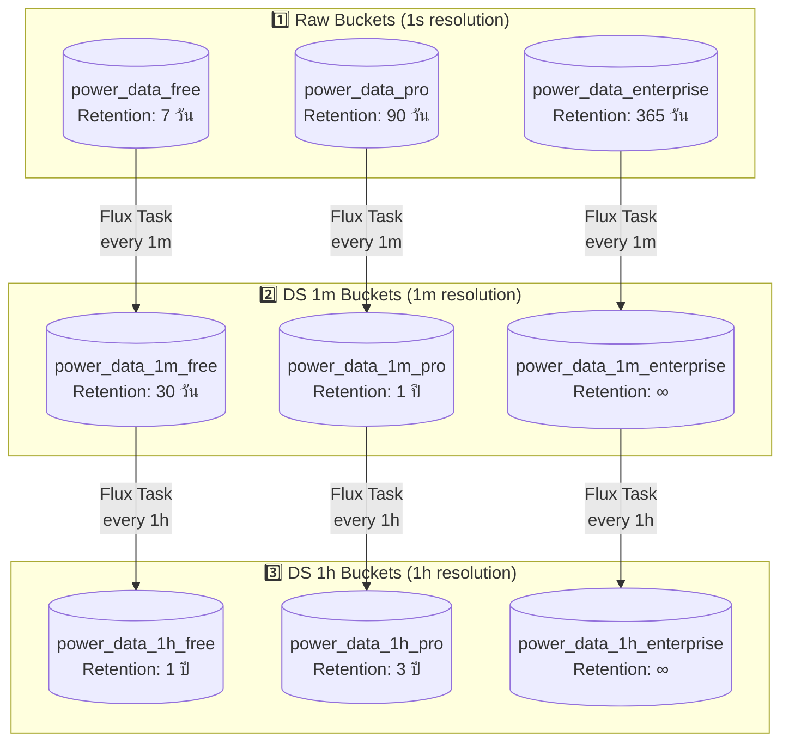
```mermaid
flowchart TD
    subgraph Raw ["1️⃣ Raw Buckets (1s resolution)"]
        R_Free[("power_data_free<br/>Retention: 7 วัน")]
        R_Pro[("power_data_pro<br/>Retention: 90 วัน")]
        R_Ent[("power_data_enterprise<br/>Retention: 365 วัน")]
    end
    
    subgraph DS1 ["2️⃣ DS 1m Buckets (1m resolution)"]
        D1_Free[("power_data_1m_free<br/>Retention: 30 วัน")]
        D1_Pro[("power_data_1m_pro<br/>Retention: 1 ปี")]
        D1_Ent[("power_data_1m_enterprise<br/>Retention: ∞")]
    end
    
    subgraph DS2 ["3️⃣ DS 1h Buckets (1h resolution)"]
        D2_Free[("power_data_1h_free<br/>Retention: 1 ปี")]
        D2_Pro[("power_data_1h_pro<br/>Retention: 3 ปี")]
        D2_Ent[("power_data_1h_enterprise<br/>Retention: ∞")]
    end
    
    R_Free -->|"Flux Task<br/>every 1m"| D1_Free
    R_Pro -->|"Flux Task<br/>every 1m"| D1_Pro
    R_Ent -->|"Flux Task<br/>every 1m"| D1_Ent
    
    D1_Free -->|"Flux Task<br/>every 1h"| D2_Free
    D1_Pro -->|"Flux Task<br/>every 1h"| D2_Pro
    D1_Ent -->|"Flux Task<br/>every 1h"| D2_Ent
```
> **ข้อดี:** อาศัยระบบ Retention ของ InfluxDB ทำหน้าที่คอยลบข้อมูลเก่าทิ้งเอง (Zero Maintenance) โดยที่ Backend ไม่ต้องเขียนสคริปต์มาเช็คหรือสั่งลบเองเลย
> **ข้อเสีย:** ต้องสร้าง 9 Buckets และ 6 Flux Tasks ตอนเริ่มต้น Setup เซิร์ฟเวอร์ครั้งแรก

> **ทำไมต้องสร้าง Bucket ใหม่แยกสำหรับ Downsampled data?**
> * เพราะข้อมูลดิบ (Raw 1 วินาที) และข้อมูลเฉลี่ย (1 นาที / 1 ชั่วโมง) มี **อายุการเก็บรักษา (Retention) ที่ต่างกัน** โดยสิ้นเชิง เช่น ข้อมูลดิบของสาย Free เก็บแค่ 7 วัน แต่ข้อมูลเฉลี่ยรายนาทีเก็บ 30 วัน ถ้ายัดรวมอยู่ใน Bucket เดียว InfluxDB จะตั้ง Retention ให้ทั้ง Bucket เป็นค่าเดียวกันเท่านั้น (ไม่สามารถตั้ง Retention แยกตาม Measurement ภายใน Bucket เดียวกันได้)
> * **มีวิธีอื่นไหม?** ใช้ InfluxDB 3.x (IOx engine) ที่กำลังพัฒนาระบบ Partition-level retention ที่อาจจะแยกอายุข้อมูลภายใน Bucket เดียวได้ในอนาคต แต่ ณ ปัจจุบัน (InfluxDB 2.x) วิธีแยก Bucket ยังคงเป็นวิธีเดียวที่เสถียรและใช้งานจริงได้

| Bucket | ความละเอียด | Retention | ใช้กับ Tier | 
|:-------|:------------|:----------|:-----------|
| `power_data_free` | 1 วินาที | 7 วัน | Free |
| `power_data_pro` | 1 วินาที | 90 วัน | Pro |
| `power_data_enterprise` | 1 วินาที | 365 วัน | Enterprise |
| `power_data_1m_free` | 1 นาที | 30 วัน | Free |
| `power_data_1m_pro` | 1 นาที | 365 วัน | Pro |
| `power_data_1m_enterprise` | 1 นาที | ไม่จำกัด (∞) | Enterprise |
| `power_data_1h_free` | 1 ชั่วโมง | 365 วัน (1 ปี) | Free |
| `power_data_1h_pro` | 1 ชั่วโมง | 1095 วัน (3 ปี) | Pro |
| `power_data_1h_enterprise` | 1 ชั่วโมง | ไม่จำกัด (∞) | Enterprise |

> **หมายเหตุ:** ตามสถาปัตยกรรม "Multi-Bucket" เราจะมีทั้งหมด **9 Buckets** ถ้วน และไม่ต้องใช้ Flux Task หรือ สคริปต์มานั่งเช็ค `device_subscriptions` ใน PostgreSQL เพื่อลบข้อมูลอีกต่อไป เพราะทุก Bucket มีการตั้งค่า Retention ของตัวเองไว้หมดแล้ว (Zero Maintenance)

---

## 8. กลยุทธ์ Backup & Disaster Recovery

> **ทำไมต้องมีกลยุทธ์ Backup?** เพราะ PowerView เป็นระบบ Self-hosted (ตั้งเซิร์ฟเวอร์เอง) ไม่มีผู้ให้บริการ Cloud ใดมารับผิดชอบข้อมูลให้ หากเซิร์ฟเวอร์ล่มหรือดิสก์พัง ข้อมูลค่าไฟฟ้าของลูกค้าจะสูญหายถาวร → ลูกค้าฟ้องร้องได้ ดังนั้นระบบ Backup ที่ดีต้องทำให้ "ข้อมูลมีอยู่อย่างน้อย 2 ที่เสมอ" (บนเซิร์ฟเวอร์ + บน Cloud Storage ภายนอก)
>
> **มีวิธีอื่นไหม?** ใช้ Managed Database (เช่น InfluxDB Cloud, AWS RDS) ซึ่งผู้ให้บริการจะดูแล Backup ให้ทั้งหมด แต่ต้นทุนจะแพงกว่า 100 เท่า (ดูหัวข้อ 5.2) จึงไม่คุ้มสำหรับ Startup

### 8.1 ภาพรวม

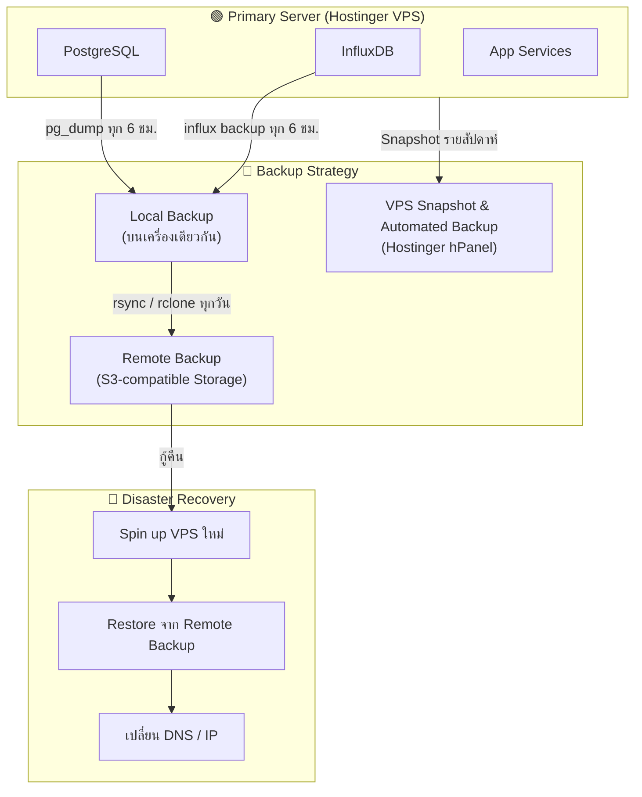
```mermaid
flowchart TD
    subgraph Primary["🟢 Primary Server (Hostinger VPS)"]
        Influx["InfluxDB"]
        PG["PostgreSQL"]
        App["App Services"]
    end
    
    subgraph Backup["💾 Backup Strategy"]
        Local["Local Backup<br/>(บนเครื่องเดียวกัน)"]
        Remote["Remote Backup<br/>(S3-compatible Storage)"]
        Snapshot["VPS Snapshot & Automated Backup<br/>(Hostinger hPanel)"]
    end
    
    subgraph DR["🔴 Disaster Recovery"]
        NewVPS["Spin up VPS ใหม่"]
        Restore["Restore จาก Remote Backup"]
        DNS["เปลี่ยน DNS / IP"]
    end
    
    Influx -->|"influx backup ทุก 6 ชม."| Local
    PG -->|"pg_dump ทุก 6 ชม."| Local
    Local -->|"rsync / rclone ทุกวัน"| Remote
    Primary -->|"Snapshot รายสัปดาห์"| Snapshot
    
    Remote -->|"กู้คืน"| NewVPS
    NewVPS --> Restore
    Restore --> DNS
```

> ☁️ **ทำไมถึงแนะนำ Cloudflare R2 สำหรับ Remote Backup? (ค่าใช้จ่าย)**
> R2 เป็น S3-compatible Storage ที่สามารถคุยผ่านสคริปต์ `rclone` หรือ `aws-cli` ได้ จุดเด่นที่เหนือกว่า AWS S3 คือ **"ฟรีค่า Egress (Bandwidth ขาออก)"** ทำให้ตอนเราทดสอบดาวน์โหลดไฟล์แบคอัปกลับมาเพื่อกู้ระบบ จะไม่โดนชาร์จเงินยิบย่อย
> * **ราคา (Pricing):** 
>   * ให้พื้นที่เก็บข้อมูลฟรี **10 GB แรกต่อเดือน** (พร้อมสิทธิ์เขียนไฟล์ 1 ล้านครั้ง)
>   * ไฟล์แบคอัปฐานข้อมูลทั้ง InfluxDB + PostgreSQL เมื่อถูกบีบอัดแล้วมักจะมีขนาดเล็ก (ประมาณหลัก 10-100 MB ต่อวัน) การหมุนเวียนเก็บย้อนหลัง 30 วัน ใช้พื้นที่รวมกันมักจะไม่เกิน 3-5 GB
> * **สรุปค่าใช้จ่าย Cloudflare R2:** เราสามารถทำ Remote Backup ข้อมูลลูกค้าได้อย่างปลอดภัยสูงสุดในราคา **$0 (ฟรี)**! และต่อให้โปรเจกต์เติบโตจนไฟล์เกิน 10 GB ก็จ่ายแค่ $0.015 ต่อ GB เท่านั้น ถือว่าคุ้มค่าและลดความเสี่ยงทางธุรกิจ (Disaster) ได้ดีที่สุดครับ

### 8.2 วิธี Backup แต่ละส่วน

#### InfluxDB Backup

```bash
# Full Backup InfluxDB (ใช้ CLI official)
influx backup /backups/influx/$(date +%Y%m%d_%H%M) \
    --host http://localhost:8087 \
    --token $INFLUXDB_TOKEN

# หรือผ่าน Docker
docker exec powerview_influxdb \
    influx backup /tmp/backup_$(date +%Y%m%d)

# Copy ออกจาก container
docker cp powerview_influxdb:/tmp/backup_20260714 ./backups/
```

**เหตุผลที่ใช้ `influx backup` ไม่ใช่ copy ไฟล์ตรง:**
- การ copy `/var/lib/influxdb2/` ขณะ DB กำลังทำงานอาจทำให้ข้อมูลเสียหาย (corrupted WAL files)
- `influx backup` ทำ consistent snapshot ที่ปลอดภัย

#### PostgreSQL Backup

```bash
# Full Backup PostgreSQL
docker exec powerview_postgres \
    pg_dump -U powerview powerview_db > /backups/pg/$(date +%Y%m%d).sql

# Compressed
docker exec powerview_postgres \
    pg_dump -U powerview -Fc powerview_db > /backups/pg/$(date +%Y%m%d).dump
```

**เหตุผลที่ใช้ `pg_dump` ไม่ใช่ copy data directory:**
- `pg_dump` สร้าง logical backup ที่สามารถ restore ข้าม version ของ PostgreSQL ได้
- เหมาะกับ database ขนาดเล็ก (User data) ที่ dump ได้ไวมาก (ไม่กี่วินาที)

#### ส่งไป Remote Storage

```bash
# ใช้ rclone ส่งไป S3-compatible storage (เช่น Backblaze B2, AWS S3 หรือ Cloudflare R2)
rclone sync /backups/ remote:powerview-backups/ --progress
```

### 8.3 ตาราง Schedule

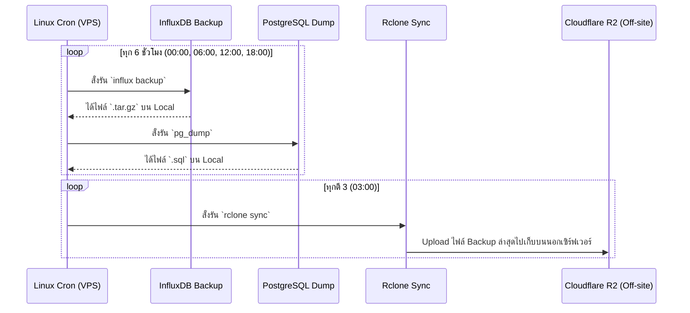
```mermaid
sequenceDiagram
    participant Cron as Linux Cron (VPS)
    participant Influx as InfluxDB Backup
    participant PG as PostgreSQL Dump
    participant Rclone as Rclone Sync
    participant S3 as Cloudflare R2 (Off-site)
    
    loop ทุก 6 ชั่วโมง (00:00, 06:00, 12:00, 18:00)
        Cron->>Influx: สั่งรัน `influx backup`
        Influx-->>Cron: ได้ไฟล์ `.tar.gz` บน Local
        Cron->>PG: สั่งรัน `pg_dump`
        PG-->>Cron: ได้ไฟล์ `.sql` บน Local
    end
    
    loop ทุกตี 3 (03:00)
        Cron->>Rclone: สั่งรัน `rclone sync`
        Rclone->>S3: Upload ไฟล์ Backup ล่าสุดไปเก็บบนนอกเซิร์ฟเวอร์
    end
```
> **ข้อดี:** การทำ Backup ภายใน (Local) ทุก 6 ชม. ช่วยลด RPO (ข้อมูลสูญหายสูงสุด) ส่วนการ Sync ออกนอกเซิร์ฟเวอร์วันละครั้ง ช่วยประหยัดแบนด์วิดท์
> **ข้อเสีย:** หากเซิร์ฟเวอร์ไฟไหม้ตอน 02:00 น. ข้อมูลที่ Backup บน Local ระหว่างวันจะหายไปทั้งหมด กู้คืนได้แค่ของเมื่อวานที่อัปขึ้น R2 ไปแล้ว

> **ทำไมเลือก Backup ทุก 6 ชม. ไม่ใช่ทุก 1 ชม. หรือทุก 24 ชม.?**
> * **ทุก 1 ชม.:** กิน Disk I/O มากเกินไป เพราะ `influx backup` สร้างไฟล์ขนาดใหญ่ทุกครั้ง → กระทบประสิทธิภาพการเขียนข้อมูล Real-time จากอุปกรณ์
> * **ทุก 24 ชม.:** ยอมเสียข้อมูลได้สูงสุด 24 ชม. หากเซิร์ฟเวอร์พัง → เกินไปสำหรับลูกค้า Pro/Enterprise ที่จ่ายเงินเก็บข้อมูล
> * **ทุก 6 ชม. (จุดสมดุล):** ยอมเสียข้อมูลได้สูงสุด 6 ชม. (RPO ≤ 6h) ซึ่งยอมรับได้สำหรับข้อมูล IoT ที่ไม่ใช่ Financial Transaction และไม่กระทบเครื่องระหว่างใช้งานปกติ

| รายการ | ความถี่ | เครื่องมือ | เก็บไว้ |
|:-------|:--------|:----------|:--------|
| InfluxDB Backup | ทุก 6 ชม. | `cron` + `influx backup` | Local → Remote |
| PostgreSQL Backup | ทุก 6 ชม. | `cron` + `pg_dump` | Local → Remote |
| Sync to Remote | ทุกวัน (03:00) | `rclone sync` | S3-compatible |
| VPS Automated Backup| ทุกสัปดาห์ (อัตโนมัติ) | Hostinger hPanel | Hostinger Server |
| VPS Snapshot | ก่อนอัปเดตระบบ (Manual) | Hostinger hPanel | ชั่วคราว (ทับของเดิม) |
| Test Restore | ทุก 1-3 เดือน | Manual | ตรวจสอบว่า backup ใช้ได้จริง |

### 8.4 Recovery Time Objective (RTO) & Recovery Point Objective (RPO)

| Metric | เป้าหมาย | วิธีทำให้ได้ |
|:-------|:---------|:-------------|
| **RPO** (ข้อมูลที่ยอมเสียได้) | ≤ 6 ชั่วโมง | Backup ทุก 6 ชม. |
| **RTO** (เวลากู้คืน) | ≤ 2 ชั่วโมง | VPS Snapshot + Remote Backup |

### 8.5 กรณีเซิร์ฟเวอร์ล่ม (Step-by-step Recovery)

```mermaid
sequenceDiagram
    participant Admin
    participant Hostinger
    participant NewVPS
    participant S3 as Remote Backup

    Admin->>Hostinger: 1. สร้าง VPS ใหม่ (ถ้าเซิร์ฟเวอร์เดิมพังหนัก)
    Admin->>Hostinger: 2. หรือกด Restore จาก Automated Backup / Snapshot
    Admin->>NewVPS: 3. ติดตั้ง Docker + Services
    S3->>NewVPS: 4. ดึง Backup มา Restore
    Admin->>NewVPS: 5. influx restore + pg_restore
    Admin->>NewVPS: 6. เปลี่ยน DNS ชี้มาที่ IP ใหม่
    Admin->>NewVPS: 7. ทดสอบระบบทั้งหมด
```

**สิ่งที่เสียไป:** ข้อมูล IoT ระหว่างเวลา backup ล่าสุดกับเวลาที่พัง (สูงสุด 6 ชม.)
**สิ่งที่ไม่เสีย:** ข้อมูล User, Billing, Subscription (backup ทุก 6 ชม.)

### 8.6 ระบบ manage.sh ที่มีอยู่แล้ว

โปรเจกต์มีสคริปต์ `manage.sh` (Control Panel) ที่รองรับ Backup/Restore แล้ว:

| เมนู | ฟังก์ชัน |
|:-----|:---------|
| 5. Backup InfluxDB | สำรองข้อมูล InfluxDB เป็น `.tar.gz` |
| 6. Restore InfluxDB | กู้คืนจากไฟล์ backup |
| 7. Backup PostgreSQL | สำรองข้อมูล User/Device |
| 8. Restore PostgreSQL | กู้คืนจากไฟล์ backup |

### 8.7 การจัดการความรับผิดชอบต่อข้อมูล (Data Liability & SLA)

```mermaid
flowchart TD
    Start{"เซิร์ฟเวอร์ล่ม / ข้อมูลหาย"}
    Start --> Check{"ลูกค้า Tier อะไร?"}
    
    Check -->|Free Tier| T_Free["SLA: ไม่มี<br/>ชดเชย: ไม่รับผิดชอบใดๆ"]
    Check -->|Pro Tier| T_Pro["SLA: 99.0%<br/>ชดเชย: คืนเงินค่ารายเดือน 1 เดือน<br/>(สูงสุด 99 บาท)"]
    Check -->|Enterprise Tier| T_Ent["SLA: 99.9%<br/>ชดเชย: คืนเงินค่ารายเดือน 1-3 เดือน<br/>(สูงสุด 1,470 บาท)"]
    
    T_Free --> Legal["อ้างอิงจาก Terms of Service<br/>(ตัดจบปัญหาฟ้องร้อง)"]
    T_Pro --> Legal
    T_Ent --> Legal
```
> **ข้อดี:** แผนภาพนี้ปกป้องบริษัทจากการถูกลูกค้าหัวหมอฟ้องร้องเรียกค่าเสียหาย (เช่น โรงงานฟ้องว่าไม่มีกราฟดู ทำให้ผลิตสินค้าผิดพลาด ขาดทุน 10 ล้าน) การตีกรอบ Liability จะจำกัดความเสียหายของบริษัทไว้แค่ "ไม่เกินค่าบริการที่จ่ายมา" เท่านั้น
> **ข้อเสีย:** อาจทำให้ลูกค้า Enterprise กังวลใจ ต้องอธิบายให้ลูกค้าเข้าใจว่านี่คือมาตรฐานธุรกิจ SaaS ทั่วโลก

เมื่อเปิดให้บริการในระดับ Pro และ Enterprise สิ่งสำคัญที่สุดคือ **ความรับผิดชอบทางกฎหมาย (Liability) เมื่อเซิร์ฟเวอร์เกิดปัญหาหรือข้อมูลสูญหาย** 

**1. นโยบายการ Backup ของผู้ให้บริการ (Hostinger)**
* **Automated Backups:** Hostinger มีระบบ Backup VPS ให้ฟรีสัปดาห์ละ 1 ครั้ง (Weekly) เหมาะสำหรับกู้คืนระบบแบบเหมาเข่ง 
* **Manual Snapshots:** ก่อนจะทำการอัปเดตระบบหรือลงโปรแกรมใหม่ ทีมงานควรกดสร้าง Snapshot ไว้ (เก็บได้ 1 ตัว) หากพังก็กดย้อนกลับ (Rollback) ได้ทันที
* **ความเสี่ยงที่ต้องระวัง:** หากบัญชี Hostinger ถูกแบน ลืมจ่ายเงิน หรือ Data Center ของ Hostinger ไฟไหม้ Backups ที่อยู่บนระบบ Hostinger จะหายทั้งหมด! **(จึงเป็นเหตุผลว่าทำไมข้อ 8.2 ถึงต้องยิง backup ออกไปเก็บที่ S3-compatible ที่อื่นด้วยเสมอ)**

**2. การตั้งเงื่อนไขการให้บริการ (Terms of Service / SLA)**
เพื่อป้องกันบริษัทโดนลูกค้าฟ้องร้องเรียกค่าเสียหายระดับล้านบาทจากการสูญหายของข้อมูล (เช่น ลูกค้าอ้างว่าข้อมูลสูญหายทำให้โรงงานขาดทุน) คุณ **จำเป็นต้องระบุเงื่อนไข** เหล่านี้ในหน้าสมัครสมาชิก:

* **กลุ่ม Free Tier:**
  * **SLA:** No SLA (Best Effort) ทำดีที่สุดแต่ไม่รับประกันอัปไทม์
  * **Liability:** บริษัทไม่รับผิดชอบต่อการสูญหายของข้อมูลทุกกรณี
* **กลุ่ม Pro Tier (99 ฿/เดือน):**
  * **SLA:** 99.0% Uptime (ระบบอาจล่มได้ไม่เกิน 7 ชั่วโมง/เดือน)
  * **Liability (จำกัดความรับผิดชอบ):** หากข้อมูลสูญหายหรือเซิร์ฟเวอร์ล่มเกินกำหนด บริษัทจะชดเชยสูงสุด **ไม่เกินค่าบริการรายเดือนของเดือนนั้นๆ (สูงสุด 99 บาท)**
* **กลุ่ม Enterprise Tier (490 ฿+/เดือน):**
  * **SLA:** 99.9% Uptime (ระบบอาจล่มได้ไม่เกิน 43 นาที/เดือน)
  * **Liability:** บริษัทมีการ Backup แยกต่างหาก (Off-site) แต่หากเกิดเหตุสุดวิสัยระดับมหภาค (Force Majeure) การชดเชยจะจำกัดอยู่ที่ไม่เกิน **ค่าบริการ 1-3 เดือนล่าสุด** เท่านั้น ห้ามรับผิดชอบต่อ "มูลค่าความเสียหายทางธุรกิจที่ตามมา (Consequential Damages)" เด็ดขาด

> **ข้อแนะนำเพิ่มเติม:** ควรใช้คำศัพท์ทางกฎหมายในข้อตกลง เช่น *"ข้อมูลทั้งหมดให้บริการตามสภาพ (As-Is) ทางเราจะดำเนินการ Backup ให้ดีที่สุด แต่ไม่สามารถรับประกันความปลอดภัยระดับ 100% ได้"*

### 8.8 วิเคราะห์ต้นทุนการสำรองข้อมูลแบบ Off-site (S3-compatible Storage)

```mermaid
flowchart LR
    subgraph VPS ["Primary Server (Hostinger)"]
        Rclone["Rclone<br/>(Upload Backup)"]
    end
    
    subgraph Providers ["S3-Compatible Providers"]
        B2["Backblaze B2<br/>Storage: $0.006/GB<br/>Egress: $0.01/GB"]
        R2["Cloudflare R2<br/>Storage: $0.015/GB<br/>Egress: 🆓 FREE!"]
        AWS["AWS S3<br/>Storage: $0.023/GB<br/>Egress: $0.09/GB (แพงมาก!)"]
    end
    
    Rclone --> B2
    Rclone -->|"✅ ตัวเลือกที่แนะนำ"| R2
    Rclone -->|"❌ ห้ามใช้"| AWS
```
> **ข้อดี:** Cloudflare R2 ทำให้ต้นทุนการ "ทดสอบการกู้คืน (Test Restore)" เป็น 0 บาท เพราะไม่มีค่าดาวน์โหลดข้อมูลออก (Egress fee)
> **ข้อเสีย:** ค่า Storage ของ R2 แพงกว่า B2 เล็กน้อย แต่เมื่อหักลบกับความสะดวกและไม่มีค่า Egress ถือว่าคุ้มกว่ามาก

การส่ง Backup ออกไปเก็บนอกเซิร์ฟเวอร์ (Off-site) เป็นเรื่องจำเป็น แต่ต้องเลือกผู้ให้บริการที่ "ค่าส่งข้อมูลออก (Egress Fee) ถูก" และ "ค่าพื้นที่เก็บข้อมูล (Storage) ถูก" เพื่อไม่ให้เป็นภาระต้นทุน 

**ผู้ให้บริการ S3-compatible ที่แนะนำ:**
1. **Backblaze B2:** ราคาถูกมากเพียง **$0.006 / GB / เดือน** (~0.21 บาท/GB)
2. **Cloudflare R2:** ราคา **$0.015 / GB / เดือน** (~0.53 บาท/GB) แต่มีข้อดีคือ **ฟรีค่า Egress 100%** และให้พื้นที่ฟรี 10 GB แรก

**การจำลองต้นทุน (สมมติว่าเก็บ Full Backup ย้อนหลัง 2 สัปดาห์ = 2 Copies)**

| จำนวน Devices | ขนาดข้อมูลรวม (x 2 Copies) | ต้นทุน Backblaze B2 | ต้นทุน Cloudflare R2 | ต้นทุน AWS S3 (เปรียบเทียบ)* |
|:--------------|:---------------------------|:--------------------|:---------------------|:-----------------------------|
| **100 เครื่อง** | ~50 GB | ~$0.30 (~10 ฿/เดือน) | ~$0.75 (~26 ฿/เดือน) | ~$1.20 (~42 ฿/เดือน) |
| **1,000 เครื่อง**| ~550 GB | ~$3.30 (~115 ฿/เดือน)| ~$8.25 (~290 ฿/เดือน)| ~$12.65 (~440 ฿/เดือน)|
| **5,000 เครื่อง**| ~2,750 GB (2.75 TB) | ~$16.50 (~580 ฿/เดือน)| ~$41.25 (~1,450 ฿/เดือน)| ~$63.25 (~2,210 ฿/เดือน)|

> *หมายเหตุ: AWS S3 มีค่าพื้นที่เก็บข้อมูลแพงที่สุด และที่อันตรายคือมี **Data Transfer Out (Egress Fee)** มหาศาลเมื่อคุณต้องการดาวน์โหลดไฟล์ Backup กลับมา Restore (ประมาณ $0.09/GB หรือตก 8,000 บาท หากต้องโหลดข้อมูล 2.75 TB) ในขณะที่ **Cloudflare R2 ดาวน์โหลดฟรีไม่คิดเงินเพิ่ม**

**กลยุทธ์ที่แนะนำ:** ใช้ **Cloudflare R2** ในช่วงเริ่มต้นเพราะเซ็ตอัพง่าย เชื่อมต่อกับระบบ DNS ของ Cloudflare ได้เลย และรับประกันว่าไม่มีค่าใช้จ่ายแฝงตอนดาวน์โหลดไฟล์กลับมาแน่นอน (No Egress Fee)
---

## 9. เหตุผลการเลือกใช้เครื่องมือ (Technology Justification)

### 9.1 ทำไมต้อง InfluxDB? (ไม่ใช่ TimescaleDB, QuestDB, ClickHouse)

```mermaid
flowchart TD
    Start{"เลือก Time-Series DB"}
    
    Start --> A("TimescaleDB")
    Start --> B("ClickHouse")
    Start --> C("InfluxDB 2.x")
    
    A --> A1["ข้อดี: ใช้ SQL ได้เลย, ACID ดี<br/>ข้อเสีย: กิน RAM หนัก (PostgreSQL base)"]
    B --> B1["ข้อดี: เร็วที่สุดในโลก (OLAP)<br/>ข้อเสีย: Setup ยาก, ไม่มี Downsample ในตัว"]
    
    C -->|"✅ เลือกใช้อันนี้"| C1["ข้อดี: สร้างมาเพื่อ Time-Series โดยตรง<br/>กินทรัพยากรน้อยมาก (TSM Engine)<br/>มีระบบ Downsample ในตัว (Flux Task)"]
```
> **ข้อดี:** InfluxDB เป็น "All-in-one Solution" สำหรับข้อมูล Time-Series ช่วยลดภาระการเขียนสคริปต์ลบข้อมูล และสคริปต์หาค่าเฉลี่ย
> **ข้อเสีย:** ต้องเรียนรู้ภาษา Flux (ที่คล้าย JavaScript) แทนที่จะใช้ SQL ปกติ

| เกณฑ์ | InfluxDB 2.x | TimescaleDB | QuestDB | ClickHouse |
|:------|:-------------|:------------|:--------|:-----------|
| **Write Performance** | ✅ สูงมาก (>1M points/sec) | ดี (แต่ต้อง tune PostgreSQL) | สูงมาก | สูงมาก (OLAP) |
| **Compression** | ✅ ดีเยี่ยม (Gorilla + Delta) | ดี (PostgreSQL TOAST) | ดี | ดีมาก (columnar) |
| **Built-in Downsampling** | ✅ Flux Tasks ในตัว | ต้องเขียน SQL cron เอง | ไม่มี built-in | ต้อง Materialized Views |
| **Built-in Retention Policy** | ✅ ตั้งค่าง่าย per-bucket | ต้องเขียน cron เอง | มี แต่จำกัด | TTL ได้ |
| **Backup Tools** | ✅ `influx backup` CLI | `pg_dump` | ต้อง copy files | ClickHouse backup |
| **Memory Footprint** | ปานกลาง (~500MB-2GB) | สูง (PostgreSQL) | ต่ำมาก | สูง |
| **Learning Curve** | Flux = เรียนรู้ใหม่ | SQL = คุ้นเคย | SQL = คุ้นเคย | SQL dialect = ต้องเรียน |
| **IoT Ecosystem** | ✅ Telegraf, MQTT plugin | ต้องเขียนเอง | ต้องเขียนเอง | ต้องเขียนเอง |
| **Docker Image Size** | ~200 MB | ~500 MB+ | ~50 MB | ~200 MB |

**เหตุผลที่เลือก InfluxDB:**
1. **ระบบ Downsampling ในตัว** — สำคัญมากสำหรับ Billing system เพราะต้อง downsample ตาม Tier → InfluxDB มี Flux Tasks ที่ทำได้เลยไม่ต้องเขียน cron script เพิ่ม
2. **Retention Policy ในตัว** — ตั้ง retention per-bucket ได้ง่าย → ตรงกับ Tier system ที่ต้องลบ data เก่าตามแพ็คเกจ
3. **IoT Ecosystem** — มี Telegraf ที่รองรับ MQTT input โดยตรง, มี community plugins เยอะ
4. **Compression ดี** — จากการวัดจริง ~2.5 bytes/point → ลดค่า Storage ได้มาก

### 9.2 ทำไมต้อง PostgreSQL? (ไม่ใช่ MySQL, MongoDB, SQLite)

```mermaid
flowchart TD
    Start{"เลือก DB สำหรับระบบ Billing"}
    
    Start --> A("MongoDB")
    Start --> B("MySQL")
    Start --> C("PostgreSQL")
    
    A --> A1["ข้อดี: NoSQL ยืดหยุ่น<br/>ข้อเสีย: ACID ไม่แข็งเท่า SQL (เสี่ยงข้อมูลการเงินเพี้ยน)"]
    B --> B1["ข้อดี: คนใช้เยอะที่สุด<br/>ข้อเสีย: ระบบ UUID / JSON Index ไม่ดีเท่า PostgreSQL"]
    
    C -->|"✅ เลือกใช้อันนี้"| C1["ข้อดี: ACID แข็งแกร่งที่สุด<br/>รองรับ Native UUID และ JSONB<br/>เหมาะกับข้อมูลทางการเงิน 100%"]
```
> **ข้อดี:** PostgreSQL รองรับ Transaction ได้สมบูรณ์แบบ มั่นใจได้ว่าข้อมูลการตัดเงิน และสถานะการต่ออายุของลูกค้าจะไม่ขัดแย้งกัน
> **ข้อเสีย:** ต้องดูแล Database เพิ่มอีก 1 ตัวแยกจาก InfluxDB

| เกณฑ์ | PostgreSQL | MySQL | MongoDB | SQLite |
|:------|:-----------|:------|:--------|:-------|
| **ACID Compliance** | ✅ Full | Full | Partial (per-doc) | Full (single file) |
| **UUID Support** | ✅ Native `uuid` type | ต้อง BINARY(16) | ObjectID (ไม่ standard) | ไม่มี native |
| **JSON Support** | ✅ `jsonb` (indexed) | JSON (ไม่ index) | ✅ Native | ไม่มี |
| **Concurrent Writes** | ✅ MVCC ดีมาก | Lock-based (MyISAM) | ดี | ❌ Single-writer |
| **ORM Support** | ✅ SQLAlchemy native | ดี | Mongoose (different pattern) | ดี |
| **Financial Data** | ✅ `numeric` type (exact) | `DECIMAL` (ดี) | ⚠️ float issues | `REAL` (float) |

**เหตุผลที่เลือก PostgreSQL:**
1. **ACID สำหรับ Billing** — การคิดเงินต้องการ transactional integrity ระดับ 100% ไม่ยอมให้เกิด partial write
2. **UUID สำหรับ API** — ใช้ UUID เป็น PK ป้องกัน enumeration attack (ลูกค้าเดา ID คนอื่นไม่ได้)
3. **Numeric type** — เก็บเงินเป็น `integer` (สตางค์) + `numeric` type ป้องกัน floating point error
4. **Already in stack** — ใช้อยู่แล้วในระบบ (User, Device) → ไม่ต้องเพิ่ม dependency ใหม่

### 9.3 ทำไมต้อง Self-hosted? (ไม่ใช่ InfluxDB Cloud / AWS)

```mermaid
flowchart LR
    subgraph S1 ["Self-Hosted (Hostinger)"]
        SH["ต้นทุนคงที่ (Fixed Cost)<br/>~1,600 ฿ / เดือน<br/>รับ Device ได้ 5,000+ เครื่อง"]
    end
    
    subgraph S2 ["Managed Cloud (AWS / InfluxCloud)"]
        MC["ต้นทุนผันแปร (Variable Cost)<br/>~300,000 ฿ / เดือน<br/>จ่ายตามปริมาณ Data Points ที่ยิงเข้า"]
    end
    
    S1 -->|"✅ Scale ได้กำไร 95%"| Profit["ธุรกิจยั่งยืน (Profitable)"]
    S2 -->|"❌ Scale แล้วเจ๊ง"| Loss["ธุรกิจขาดทุน (Bankrupt)"]
```
> **ข้อดี:** ธุรกิจ Hardware IoT ยิงข้อมูลความถี่สูงมาก (ทุก 1 วินาที) หากใช้ Managed Cloud บริษัทจะล้มละลายทันทีที่ Scale Self-hosted คือทางรอดเดียวของธุรกิจโมเดลนี้
> **ข้อเสีย:** ต้องมีทีมงาน (DevOps/SysAdmin) คอยดูแลเซิร์ฟเวอร์ และรับมือตอนที่เซิร์ฟเวอร์ล่มด้วยตัวเอง

| เกณฑ์ | Self-hosted (Contabo) | InfluxDB Cloud | AWS IoT + Timestream |
|:------|:---------------------|:---------------|:---------------------|
| **ค่าใช้จ่าย 1,000 devices** | ~290 ฿/เดือน | ~420,000 ฿/เดือน | ~300,000+ ฿/เดือน |
| **Data Sovereignty** | ✅ เรา control ทั้งหมด | ข้อมูลอยู่ cloud ผู้อื่น | ข้อมูลอยู่ AWS |
| **ความยืดหยุ่น** | ✅ ตั้งค่าได้ตามใจ | จำกัดตาม plan | ต้องใช้ AWS ecosystem |
| **Vendor Lock-in** | ✅ ไม่มี | ปานกลาง | สูงมาก |
| **Maintenance** | ❌ ต้องดูแลเอง | ไม่ต้อง | ไม่ต้อง |

**เหตุผลที่เลือก Self-hosted:**
1. **ต้นทุนต่ำกว่า 100-1,000 เท่า** — เมื่อ device เยอะและส่งข้อมูลทุกวินาที cloud pricing จะแพงอย่างรวดเร็ว
2. **ผลิตเครื่องขายเอง** — เรา control ทั้ง hardware + software → self-host ได้ง่ายเพราะรู้ workload ชัดเจน
3. **ข้อมูลไฟฟ้าเป็นข้อมูลละเอียดอ่อน** — ลูกค้าบางรายอาจไม่ต้องการให้ข้อมูลการใช้ไฟฟ้าอยู่บน public cloud

### 9.4 ทำไมต้อง MQTT? (ไม่ใช่ HTTP / WebSocket / gRPC)

```mermaid
sequenceDiagram
    participant HW as Device
    participant S as Server
    
    Note over HW,S: เปรียบเทียบ 1 วินาที
    
    rect rgb(255, 230, 230)
        Note over HW,S: ❌ HTTP REST API (Overhead สูง)
        HW->>S: 1. TCP Handshake (SYN)
        S->>HW: 2. SYN-ACK
        HW->>S: 3. ACK
        HW->>S: 4. TLS Handshake (ช้ามาก)
        HW->>S: 5. POST /data (Header 200+ bytes)
        S->>HW: 6. 200 OK
        HW->>S: 7. Close Connection
    end
    
    rect rgb(230, 255, 230)
        Note over HW,S: ✅ MQTT (Overhead ต่ำสุด)
        Note over HW,S: (เชื่อมต่อ TCP/TLS ทิ้งไว้ตั้งแต่เปิดเครื่อง)
        HW->>S: 1. PUBLISH /data (Header 2 bytes)
    end
```
> **ข้อดี:** MQTT กินแบนด์วิดท์น้อยที่สุด (Header แค่ 2 bytes) และประหยัดแบตเตอรี่/CPU ของบอร์ด ESP32/MCU มากที่สุด เหมาะสำหรับการส่งข้อมูลรัวๆ ทุกวินาที
> **ข้อเสีย:** ต้องเปิด TCP Connection แช่ทิ้งไว้ตลอดเวลา Server ต้องรองรับ Concurrent Connections (Socket) มหาศาล

| เกณฑ์ | MQTT | HTTP REST | WebSocket | gRPC |
|:------|:-----|:----------|:----------|:-----|
| **Bandwidth** | ✅ ต่ำมาก (~2 bytes header) | สูง (~200+ bytes header) | ปานกลาง | ต่ำ (protobuf) |
| **Battery** | ✅ ประหยัดสุด | ต้องเปิด connection ใหม่ | ดี | ดี |
| **QoS** | ✅ 0, 1, 2 ในตัว | ต้องทำเอง | ต้องทำเอง | ต้องทำเอง |
| **Offline Buffering** | ✅ Retained messages | ❌ ไม่มี | ❌ ไม่มี | ❌ ไม่มี |
| **IoT Standard** | ✅ ISO/IEC 20922 | ✅ ใช้ทั่วไป | ❌ | ❌ |

**เหตุผล:** อุปกรณ์ IoT ส่ง 33 fields ทุก 1 วินาที ตลอด 24 ชม. → ต้องการ protocol ที่กินทรัพยากรน้อยที่สุด MQTT เป็นมาตรฐานอุตสาหกรรม IoT มี QoS ในตัว ประหยัดแบนด์วิดท์สูงสุด

---

## 10. โฟลว์การชำระเงินผ่าน Stripe (Payment Gateway Flow)

> **ทำไมเลือก Stripe ไม่ใช่ Omise (Opn Payments) หรือ 2C2P?**
> * **Omise (Opn Payments):** เป็นบริษัทไทย รองรับ PromptPay ดี แต่ระบบ Subscription Billing (ตัดเงินรายเดือนอัตโนมัติ) ยังไม่สมบูรณ์เท่า Stripe มี API Documentation น้อยกว่า และ Community/Library ที่ใช้ร่วมกับ Python ยังจำกัด
> * **2C2P:** เน้นตลาดเอเชียตะวันออกเฉียงใต้ รองรับช่องทางจ่ายเงินท้องถิ่นเยอะมาก แต่ระบบ Developer API ซับซ้อนกว่า Stripe มาก ไม่มี Stripe Checkout (หน้าจ่ายเงินสำเร็จรูป) ที่ช่วยลดภาระ PCI-DSS ได้
> * **Stripe:** มี API ดีที่สุดในโลก, มี Checkout Session สำเร็จรูป (ไม่ต้องสัมผัสข้อมูลบัตรเครดิตเลย), รองรับ Subscription Billing อัตโนมัติ, รองรับ PromptPay ในไทย, และมี Documentation + Library (Python SDK) ที่สมบูรณ์ที่สุด
> * **ข้อเสียของ Stripe:** ค่าธรรมเนียมต่อรายการ (3.65% + 10 THB) สูงกว่า Omise (3.65% + 0 THB) เล็กน้อย แต่สำหรับยอดเงิน 99 บาท/เดือน ส่วนต่างนี้ไม่มีนัยสำคัญ (ตก ~10 บาท/รายการ)

### 10.1 สถาปัตยกรรมการชำระเงินและต่ออายุ (Subscription)

เพื่อรองรับการรับชำระเงินผ่านบัตรเครดิต (รวมถึง Google Pay / Apple Pay / PromptPay ที่ Stripe รองรับ) เราจะใช้ Stripe ในรูปแบบ Webhook ควบคู่กับฐานข้อมูล PostgreSQL

```mermaid
sequenceDiagram
    autonumber
    actor User
    participant MobileApp
    participant API as Core API (Python)
    participant DB as PostgreSQL
    participant Stripe as Stripe Gateway
    
    User->>MobileApp: เลือกอุปกรณ์ & กดสมัคร Pro Tier
    MobileApp->>API: POST /billing/checkout-session {device_id, tier_id}
    API->>Stripe: Create Checkout Session (ส่ง price_id)
    Stripe-->>API: Return Session URL
    API-->>MobileApp: Return Checkout URL
    MobileApp->>User: เปิดหน้า Stripe Checkout ในแอป/เบราว์เซอร์
    User->>Stripe: กรอกข้อมูลบัตรเครดิต / สแกนจ่าย
    Stripe-->>User: แสดงหน้าสำเร็จ & Redirect กลับแอป
    
    Note over API,Stripe: Asynchronous Webhook (ทำงานเบื้องหลัง)
    Stripe->>API: Webhook: checkout.session.completed (payment_intent.succeeded)
    API->>API: Verify Stripe Signature ป้องกันปลอมแปลง
    API->>DB: Insert/Update `PAYMENTS` (status=completed)
    API->>DB: Upsert `DEVICE_SUBSCRIPTIONS` (ต่ออายุ expires_at)
    
    MobileApp->>API: Polling เช็คสถานะ หรือ รับผ่าน WebSocket
    API-->>MobileApp: สถานะ Active! เปิดฟีเจอร์ Pro
```

### 10.2 ข้อดีของการใช้รูปแบบ Stripe Webhook (Async Flow)

```mermaid
sequenceDiagram
    participant User
    participant App
    participant Backend
    participant Stripe
    
    Note over User,Stripe: ❌ Sync Flow (อันตราย)
    User->>Stripe: จ่ายเงินสำเร็จ
    Stripe-->>App: กลับมาที่แอป (Redirect)
    Note over App: 💥 เน็ตมือถือหลุดตรงนี้!
    App--xBackend: (ส่งยืนยันไม่ได้)
    Note over User,Backend: ลูกค้าโดนตัดเงิน แต่แอปไม่เปลี่ยนเป็น Pro<br/>→ ร้องเรียน / ด่าบริษัท
    
    Note over User,Stripe: ✅ Async Webhook (ปลอดภัย 100%)
    User->>Stripe: จ่ายเงินสำเร็จ
    Stripe-->>App: กลับมาที่แอป (เน็ตจะหลุดก็ไม่เป็นไร)
    Stripe->>Backend: Server-to-Server ยิงมาบอกหลังบ้านโดยตรง!
    Backend->>Backend: อัปเดต Pro สำเร็จ! (แม้ลูกค้าปิดแอปไปแล้ว)
```
> **ข้อดี:** ปิดจุดตายเรื่อง "เน็ตมือถือหลุด" หรือ "ลูกค้ากดปิดแอปไวเกินไป" เพราะระบบคุยกันหลังบ้านข้ามทวีป (Stripe Server ↔ PowerView Server) โดยตรง
> **ข้อเสีย:** ฝั่ง Mobile App ต้องเขียน Logic แบบ "Polling" หรือรอ "WebSocket" เพื่อเช็คว่าหลังบ้านอัปเดตสถานะเสร็จหรือยัง

> **ทำไมใช้ Webhook (Async) แทนที่จะใช้ Sync Flow (จ่ายเงิน → รอผล → เปิด Pro ทันที)?**
> * **Sync Flow มีจุดตาย:** หากลูกค้าจ่ายเงินเสร็จแล้ว แต่เน็ตหลุดก่อนที่เซิร์ฟเวอร์จะได้รับยืนยัน → ลูกค้าโดนตัดเงินแต่ไม่ได้ Pro → ต้องมีทีม Support คอยแก้ปัญหาทีละเคส (เสียเวลามาก)
> * **Webhook แก้ปัญหานี้ได้:** Stripe จะยิง Webhook มาหาเซิร์ฟเวอร์เราโดยตรงแบบ Server-to-Server (ไม่ผ่านมือถือลูกค้า) → แม้ลูกค้าปิดแอปไปแล้ว ระบบก็ยังเปิด Pro ได้สำเร็จเบื้องหลัง
> * **ทางเลือกอื่น:** Stripe Payment Intents API (Inline Card Form) → สามารถรับข้อมูลบัตรในแอปเราได้โดยตรง แต่ต้องใช้ Stripe.js SDK ซึ่งเพิ่มความซับซ้อนในการพัฒนา Mobile App และยังต้องใช้ Webhook อยู่ดีเพื่อรับ Subscription Events

- **ป้องกันลูกค้าปิดแอปก่อน:** ถึงแม้ลูกค้าจ่ายเงินเสร็จแล้วเน็ตหลุด หรือแอปค้างไปก่อนที่จะ Redirect กลับ การตัดเงินก็จะถูกยืนยันผ่านทาง Webhook ที่ Stripe ยิงมาหา Backend เราโดยตรง ทำให้ไม่เกิดปัญหา "ตัดเงินแล้วไม่ได้ Pro"
- **รองรับ Subscription อัตโนมัติ:** เมื่อถึงรอบเดือนถัดไป Stripe จะตัดเงินอัตโนมัติ และยิง Webhook `invoice.payment_succeeded` มาให้ API เราอัปเดต `expires_at` ยืดไปอีก 1 เดือนโดยอัตโนมัติ

### 11.3 ความปลอดภัยทางบัญชีและบัตรเครดิต (Security & PCI-DSS Compliance)

```mermaid
flowchart TD
    subgraph DangerZone ["🔴 โซนอันตราย (PCI-DSS Scope)"]
        Card["ข้อมูลบัตรเครดิต<br/>1234-5678-XXXX-XXXX"]
        Stripe["Stripe Servers<br/>(ผ่านมาตรฐาน PCI ระดับสูงสุด)"]
    end
    
    subgraph SafeZone ["🟢 โซนปลอดภัย (Out of Scope)"]
        User["มือถือลูกค้า"]
        Power["PowerView Server<br/>(เก็บแค่ Token & สถานะ)"]
    end
    
    User -- "พิมพ์เลขบัตรลงหน้าเว็บ Stripe" --> Stripe
    User -. "❌ ห้ามส่งเลขบัตรมาเด็ดขาด" .-> Power
    Stripe -- "ส่งแค่สถานะ 'จ่ายสำเร็จ'" --> Power
```
> **ข้อดี:** การที่เราไม่ให้เลขบัตรเครดิตลูกค้าวิ่งผ่านเซิร์ฟเวอร์ PowerView เลย ทำให้บริษัทพ้นจากความรับผิดชอบ (Liability) มหาศาล และไม่ต้องจ้างคนมาตรวจสอบมาตรฐานความปลอดภัยรายปี (ประหยัดเงินหลายล้านบาท)

ในการพัฒนาระบบรับชำระเงิน **มาตรฐาน PCI-DSS (Payment Card Industry Data Security Standard)** เป็นเรื่องที่ซีเรียสที่สุด หากเซิร์ฟเวอร์บริษัททำข้อมูลบัตรเครดิตลูกค้าหลุด บริษัทจะถูกฟ้องร้องมูลค่ามหาศาล

ด้วยสถาปัตยกรรมของ PowerView ที่เลือกใช้ **Stripe Checkout (Redirect)** ทำให้เราปลอดภัย 100%:
1. **Zero Data on Server:** ข้อมูลหมายเลขบัตรเครดิต, CVC, และวันหมดอายุ จะถูกกรอกบนหน้าเว็บของ Stripe โดยตรง ข้อมูลเหล่านี้ **"ไม่เคยถูกส่งผ่าน หรือ บันทึกลงในเซิร์ฟเวอร์ (Database) ของ PowerView เลยแม้แต่ตัวอักษรเดียว"**
2. **Out of Scope for PCI-DSS:** เนื่องจากเราไม่เคยสัมผัสข้อมูลบัตรเครดิต เซิร์ฟเวอร์ PowerView จึงหลุดพ้นจากข้อบังคับการตรวจสอบความปลอดภัย PCI-DSS ระดับสูงสุดที่วุ่นวายและมีต้นทุนสูง
3. **Audit Ready:** หากมีผู้ตรวจสอบบัญชี (Auditor) หรือนักลงทุนสอบถามเรื่องความเสี่ยง เราสามารถยืนยันได้ว่าภาระความเสี่ยงทั้งหมด (Liability) ถูกโยนไปให้ Stripe ซึ่งเป็น Payment Gateway อันดับ 1 ของโลกดูแลรับผิดชอบแทนทั้งหมด

---

## 📎 ภาคผนวก

### A. สูตรคำนวณสำคัญ

```
# 1. จำนวน Points ต่อ Device ต่อเดือน
Points/device/month = fields × 86,400 × 30
                    = 33 × 86,400 × 30
                    = 85,536,000 points

# 2. ขนาด Storage ต่อ Device ต่อเดือน (Compressed)
Storage/device/month = Points × 2.5 bytes
                     = 85,536,000 × 2.5
                     ≈ 205 MB

# 3. ขนาด Downsampled (1 นาที) ต่อ Device ต่อเดือน
DS_1m/device/month = 33 × 1,440 × 30 × 2.5 bytes
                   ≈ 3.4 MB

# 4. Break-even (จำนวน Pro devices ที่ต้องมีเพื่อคุ้มทุน)
Break_even = VPS_cost_monthly ÷ Pro_price_per_device
           = 975 ÷ 99
           ≈ 10 devices
```

### B. ข้อมูลอ้างอิง

| แหล่งข้อมูล | URL / ที่มา |
|:------------|:-----------|
| InfluxDB Storage Architecture | docs.influxdata.com |
| InfluxDB Cloud Pricing | influxdata.com/pricing |
| Contabo VPS Pricing | contabo.com/cloud-vps |
| DigitalOcean Pricing | digitalocean.com/pricing |
| Blynk Pricing | blynk.io/pricing |
| ThingsBoard Pricing | thingsboard.io/pricing |
| AWS IoT Core Pricing | aws.amazon.com/iot-core/pricing |
| hostadvice.com | hostadvice.com/vps/influxdb-hosting |

### C. Changelog

| วันที่ | เวอร์ชัน | รายละเอียด |
|:-------|:---------|:-----------|
| 2026-07-14 | 1.0 | สร้างเอกสารฉบับแรก |

---

> **จัดทำโดย:** PowerView R&D Team
> **วัตถุประสงค์:** นำเสนอระบบ Billing & Tiers สำหรับแพลตฟอร์ม PowerView IoT
